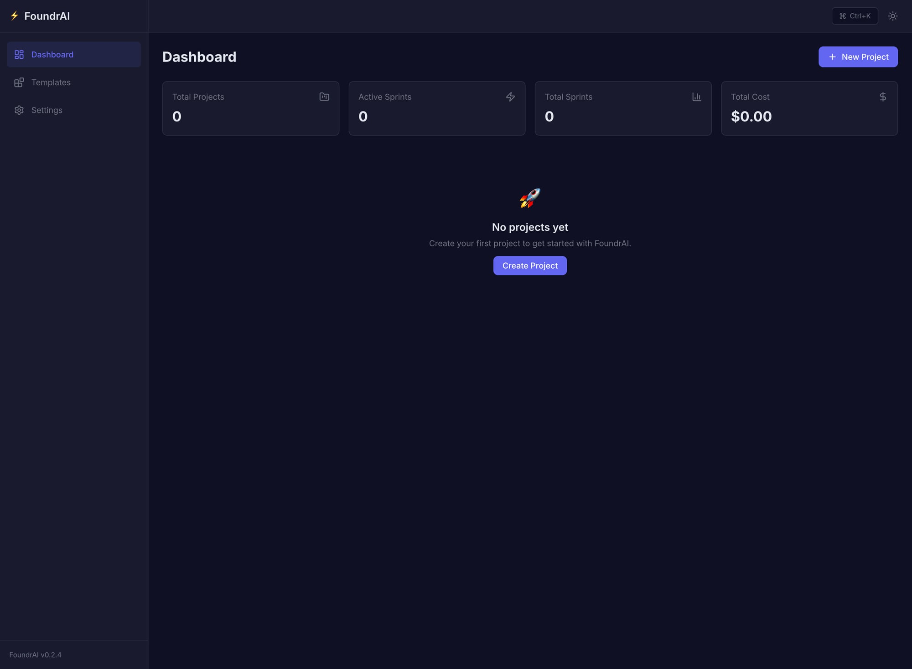
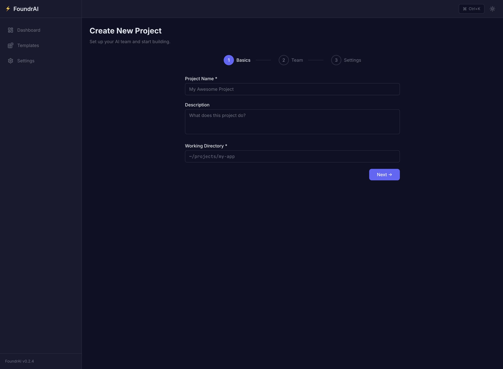
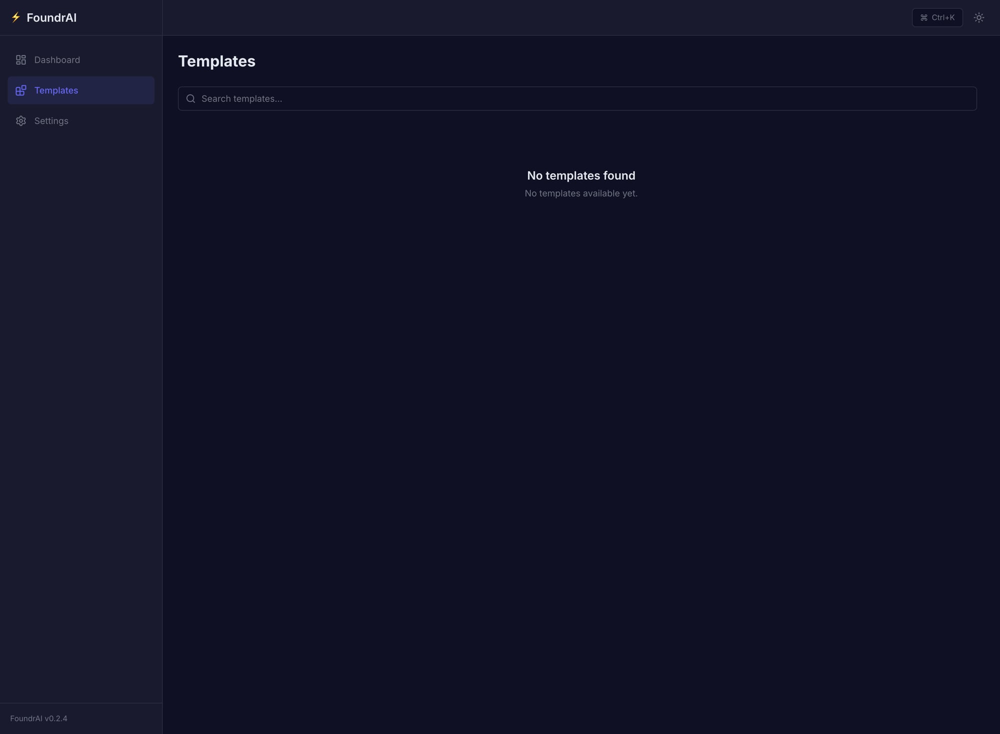
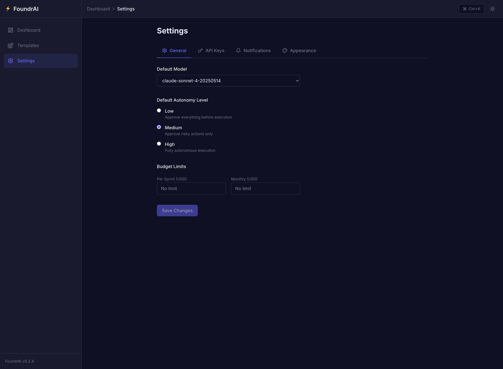
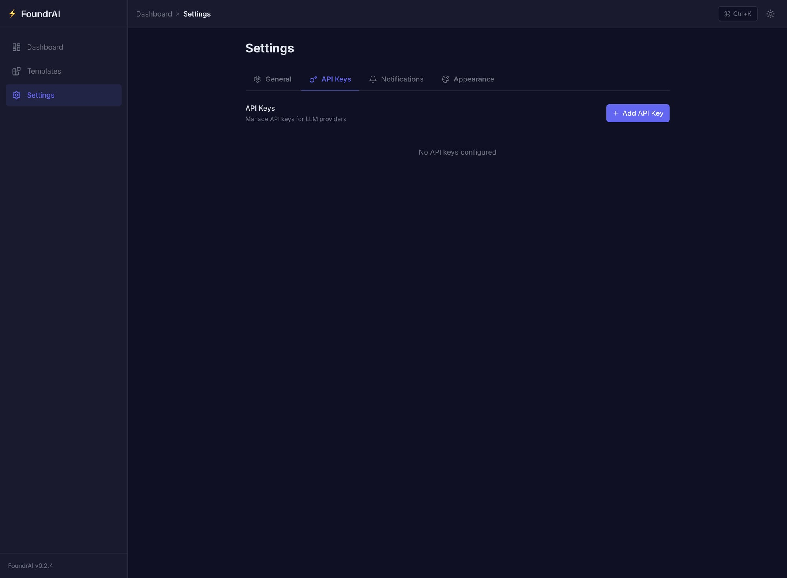
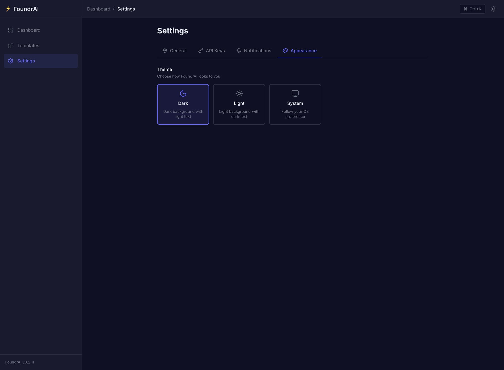
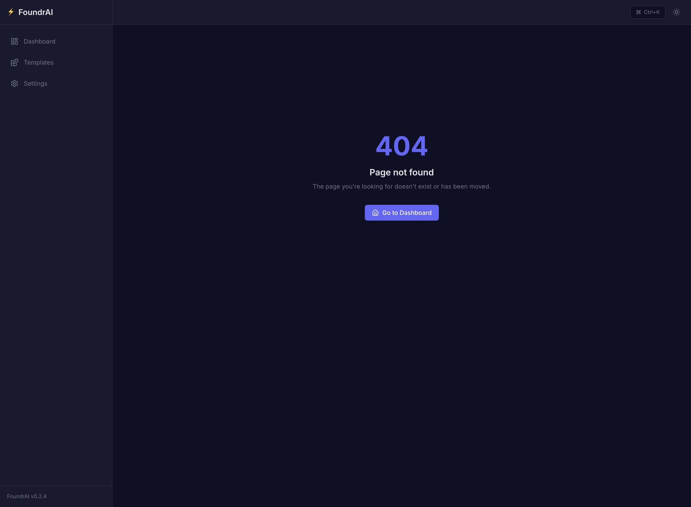

<div align="center">

# 🏢 FoundrAI

### Your AI-Powered Founding Team

**Autonomous AI agents working as an Agile startup team — with a live visual dashboard.**

[](https://pypi.org/project/foundrai/)
[](https://pypi.org/project/foundrai/)
[](https://opensource.org/licenses/MIT)

[Desktop App](#desktop-app) · [Getting Started](#getting-started) · [Documentation](./docs/) · [Roadmap](./docs/ROADMAP.md) · [Contributing](#contributing)

---

</div>

## What is FoundrAI?

FoundrAI is an open-source platform that orchestrates multiple AI agents as an autonomous Agile team. Give it a goal like *"Build a REST API for a todo app"*, and a team of specialized AI agents (Product Manager, Architect, Developer, QA) will self-organize into sprints to plan, build, test, and iterate — while you watch everything unfold on a real-time dashboard.

**Think of it as a virtual startup team you can observe, guide, and learn from.**

### What's New in v0.5.0 🚀

FoundrAI v0.5.0 introduces **Intelligence & Autonomy** — a major leap toward self-improving AI teams:

- **🧠 Progressive Trust System** — Agents build trust over time through proven performance, earning greater autonomy levels (Low → Medium → High) based on success rates and task complexity
- **❤️ Agent Health Monitoring** — Real-time performance tracking with automated interventions including model switching, cost optimization, and productivity alerts
- **💡 Model Recommendation Engine** — AI-driven system that analyzes agent performance patterns and automatically suggests optimal LLM assignments for each role and task type
- **📚 Retrospective Learning & Knowledge Base** — Cross-sprint knowledge accumulation where agents learn from past failures and successes, storing insights in a persistent organizational memory
- **🎓 Guided Onboarding Flow** — Interactive tutorial system with contextual help, sample projects, and progressive disclosure to ensure new users can quickly become productive
- **💰 Advanced Budget Management** — Granular cost tracking with per-agent budgets, warning thresholds, automatic model tier-down, and spending forecasts
- **🔒 Sandboxed Code Execution** — Secure Docker-based environment for running and testing generated code with full isolation and safety guarantees
- **🧪 Enterprise-Grade Testing** — Comprehensive E2E test infrastructure covering all critical user journeys, automated regression testing, and performance validation
- **📊 Communication Graph Visualization** — Interactive network diagrams showing agent interaction patterns, decision flows, and collaboration efficiency
- **🔍 Decision Trace Panel** — Detailed audit logs of every agent decision, reasoning chain, and action taken for full transparency and debugging

### Why FoundrAI?

| Feature | CrewAI | MetaGPT | ChatDev | AutoGen | **FoundrAI** |
|---------|--------|---------|---------|---------|-------------|
| Visual Dashboard | ❌ (Studio is commercial) | ❌ | Basic | Basic | ✅ **Real-time mission control** |
| Agile Sprints | ❌ | ❌ (single pass) | ❌ (waterfall) | ❌ | ✅ **Plan → Execute → Review → Retro** |
| Human-in-the-Loop | Basic | ❌ | ❌ | Basic | ✅ **Granular per-agent policies** |
| Iterative Learning | ❌ | ❌ | ❌ | ❌ | ✅ **Agents improve across sprints** |
| Model-Agnostic | Partial | Partial | ❌ | ✅ | ✅ **Different LLM per agent role** |
| Open Source UI | ❌ | ❌ | ❌ | Partial | ✅ **Fully open source** |

## Key Features

### 🏗️ Core Platform
🎯 **Goal → Execution Pipeline** — Enter a high-level goal and watch agents decompose, plan, and execute it through structured Agile sprints

📊 **Live Sprint Board** — Real-time Kanban showing what each agent is working on with drag-and-drop task management

💬 **Agent Communication Feed** — See every message, decision, and reasoning trace between agents with full conversation history

🎛️ **Adaptive Autonomy System** — Progressive trust levels that adjust based on agent performance and task complexity with configurable approval workflows

### 🧠 Intelligence & Learning
🔄 **Retrospective Learning** — Agents analyze sprint outcomes, identify patterns, and automatically improve their strategies for future iterations

🧠 **Knowledge Base** — Persistent learning accumulation across projects and sprints with semantic search and categorized insights

💡 **Smart Model Recommendations** — AI-driven suggestions for optimal LLM assignment per agent and task with cost-benefit analysis

❤️ **Agent Health Monitoring** — Real-time performance tracking with automated model switching, productivity alerts, and intervention recommendations

📊 **Communication Graph Visualization** — Interactive network diagrams showing agent collaboration patterns, decision flows, and team efficiency metrics

🔍 **Decision Trace Panel** — Detailed audit logs of every agent decision with reasoning chains, confidence scores, and outcome tracking

### 💰 Enterprise Features
💰 **Advanced Budget Management** — Granular cost tracking with per-agent budgets, warning thresholds, automatic tier-down, and spending forecasts

🎓 **Guided Onboarding** — Interactive tutorial system with contextual help, sample projects, and progressive feature discovery

🧪 **Comprehensive Testing** — Full E2E test infrastructure covering all critical user journeys with automated regression testing

🔒 **Sandboxed Code Execution** — Secure Docker-based environment for running and testing generated code with complete isolation and safety guarantees

🏠 **Desktop App (Tauri)** — Native desktop application with embedded Python backend for offline development and enhanced security

### 🔌 Integration & Flexibility
🔌 **Model-Agnostic** — Mix and match any LLM provider: assign Claude for PM, GPT-4o for coding, local models for QA

📈 **Performance Analytics** — Track token costs, agent performance, sprint velocity with exportable reports and trend analysis

🎨 **Customizable UI** — Dark/light themes, responsive design, and accessibility features with full keyboard navigation

## Screenshots

### Dashboard

*Main dashboard with project stats, quick actions, and empty state onboarding*

### Project Creation Wizard

*3-step project wizard — configure name, team, and settings with form validation*

### Template Browser

*Browse and search project templates with tag filtering*

### Settings — General

*Configure default model, autonomy level, and budget limits with breadcrumb navigation*

### Settings — API Keys

*Manage LLM provider API keys — add, test, and remove with masked display*

### Settings — Appearance

*Theme selector with Dark, Light, and System options*

### 404 Page

*Clean error page with navigation back to dashboard*

## Desktop App

The easiest way to use FoundrAI — download, install, double-click. No terminal required.

| Platform | Architecture | Download |
|----------|-------------|----------|
| macOS | Apple Silicon (M1/M2/M3) | [FoundrAI-darwin-aarch64.dmg](../../releases/latest) |
| macOS | Intel (x64) | [FoundrAI-darwin-x64.dmg](../../releases/latest) |
| Windows | x64 | [FoundrAI-windows-x64.msi](../../releases/latest) |
| Linux | x64 (AppImage) | [FoundrAI-linux-x64.AppImage](../../releases/latest) |

### First Launch Experience

On first launch, FoundrAI provides a guided setup wizard:

1. **API Key Configuration** — Enter credentials for at least one LLM provider (Anthropic Claude, OpenAI GPT, Google Gemini)
2. **Default Settings** — Choose your preferred model, autonomy level, and budget limits
3. **Tutorial Project** — Optional guided walkthrough with a sample "Hello World API" project
4. **Health Check** — Automatic validation of all dependencies and configurations

### Security & Privacy

The desktop app prioritizes security and privacy:

- **Local-First** — All data stays on your machine; no cloud dependencies
- **Isolated Backend** — Python server binds only to `127.0.0.1:8000` (not network-accessible)
- **Sandboxed Execution** — Generated code runs in isolated Docker containers
- **API Key Storage** — Encrypted credential storage using OS-native security APIs
- **Offline Capable** — Core functionality works without internet (except LLM API calls)

### Technical Architecture

Built with modern native technologies:

- **Frontend:** Tauri v2 with React 19 + TypeScript + Vite for near-native performance
- **Backend:** PyInstaller-bundled Python FastAPI server with all dependencies included
- **Database:** Embedded SQLite + ChromaDB for local data persistence
- **Updates:** Built-in auto-updater with incremental patches for fast releases

> **⚠️ macOS Security Note (Development Stage):**
> FoundrAI is currently in active development and the desktop app is **not yet code-signed or notarized** with Apple. When you download the DMG and copy the app to `/Applications`, macOS will block it — the app may crash on launch or show *"FoundrAI is damaged and can't be opened"* without an "Open Anyway" option in System Settings.
>
> **To fix this, run once in Terminal before launching:**
> ```bash
> xattr -cr /Applications/FoundrAI.app
> ```
> This removes the macOS quarantine flag. You only need to do this once after installation. Code signing will be added in a future release.

## Getting Started

### Option A: Desktop App (Recommended)

Download the latest release for your platform from the [Releases page](../../releases/latest) and run the installer. That's it.

### Option B: From Source

#### Prerequisites
- Python 3.11+
- Node.js 18+ & npm (for the web dashboard)
- Docker (for sandboxed code execution)
- An API key for at least one LLM provider (OpenAI, Anthropic, etc.)

#### Installation

```bash
# Clone the repo
git clone https://github.com/kyled7/foundrai.git
cd foundrai

# Install from PyPI
pip install foundrai

# Or install from source (for development)
pip install -e ".[dev]"

# Install frontend dependencies
cd frontend
npm install
```

#### Quick Start

```bash
# Configure your LLM provider(s)
export OPENAI_API_KEY="sk-..."
# and/or
export ANTHROPIC_API_KEY="sk-ant-..."

# Start the web dashboard (recommended)
cd frontend
npm run dev
# → Open http://localhost:5173

# Or use the CLI directly
foundrai sprint start "Build a REST API for a todo app with authentication"
```

### Web Dashboard (v0.2)

The dashboard is the primary interface as of v0.2. From the UI you can:
- **Create projects** via the 3-step wizard (name → team → settings)
- **Browse templates** to quick-start common project types
- **Configure settings** — default model, autonomy level, budget, API keys, theme
- **Monitor sprints** — real-time agent feed, Kanban board, approvals (coming in v0.3)

## CLI Commands

FoundrAI also provides a CLI for headless usage:

```bash
foundrai doctor          # Check system health and prerequisites
foundrai sprint start    # Start a sprint from a goal description
foundrai status          # Project status and monitoring
foundrai logs            # View agent logs
foundrai serve           # Launch the web dashboard on port 8420
```

## Architecture

```
┌─────────────────────────────────────────────────────┐
│         Desktop Shell (Tauri v2 / Browser)           │
├─────────────────────────────────────────────────────┤
│       Frontend (React 19 + TypeScript + Vite)        │
│   TanStack Router/Query │ React Flow │ Recharts      │
│  Sprint Board │ Agent Feed │ Goal Tree │ Metrics     │
├─────────────────────────────────────────────────────┤
│              API Layer (FastAPI + WebSocket)          │
├─────────────────────────────────────────────────────┤
│           Orchestration (LangGraph + SprintEngine)   │
├─────────────────────────────────────────────────────┤
│              Agent Layer (LiteLLM + Tools)            │
├─────────────────────────────────────────────────────┤
│           Persistence (SQLite + ChromaDB)             │
└─────────────────────────────────────────────────────┘
```

The frontend uses modern React patterns with TanStack Router for type-safe routing and TanStack Query for server state management. All components are in a single `frontend/` directory.

See [Architecture Documentation](./docs/ARCHITECTURE.md) for full details.

## Agent Roles

| Agent | Role | What They Do |
|-------|------|-------------|
| 📋 PM | Product Manager | Decomposes goals, writes stories, prioritizes backlog |
| 🏗️ Architect | System Architect | Designs architecture, reviews technical decisions |
| 💻 Dev | Developer | Writes code, submits for review, fixes bugs |
| 🧪 QA | QA Engineer | Tests code, reports bugs, validates fixes |
| 🎨 Designer | UI/UX Designer | Creates mockups, defines user flows |
| 🚀 DevOps | DevOps Engineer | CI/CD setup, deployment, monitoring |

## Configuration

FoundrAI v0.5.0 introduces comprehensive configuration options for fine-tuning your AI team:

```yaml
# foundrai.yaml
team:
  product_manager:
    model: anthropic/claude-sonnet-4-20250514
    autonomy: notify                    # notify | require_approval | auto_approve
    trust_level: medium                 # Starts at 'medium', evolves based on performance
    health_monitoring: true
    budget_usd: 50.0                   # Per-sprint budget limit
    conditions:
      require_approval_if:
        sprint_budget_exceeded: true
        task_complexity: "high"
        
  architect:
    model: anthropic/claude-sonnet-4-20250514
    autonomy: require_approval
    trust_level: low                    # Lower trust for system-critical decisions
    health_monitoring: true
    budget_usd: 30.0
    
  developer:
    model: openai/gpt-4o
    autonomy: auto_approve
    trust_level: high                   # High trust for proven performers
    health_monitoring: true
    budget_usd: 100.0                  # Higher budget for intensive coding work
    conditions:
      require_approval_if:
        lines_changed: ">100"          # Approval needed for large changes
        test_coverage_drop: true       # Safety check for test quality
        security_risk: true            # Flag security-sensitive operations
        
  qa_engineer:
    model: openai/gpt-4o-mini          # Cost-effective model for testing
    autonomy: auto_approve
    trust_level: high
    health_monitoring: true
    budget_usd: 25.0

sprint:
  max_tasks_parallel: 3
  token_budget: 200000                # Global token budget per sprint
  budget_warning_threshold: 80        # Warning at 80% budget usage
  enable_retrospective_learning: true
  knowledge_base: true
  model_recommendations: true
  sandboxed_execution: true           # Enable Docker-based code execution
  communication_tracking: true       # Track agent interactions
  decision_tracing: true             # Log all decision reasoning

# Health monitoring and auto-optimization  
health_monitoring:
  enabled: true
  performance_threshold: 0.8          # Minimum acceptable performance score
  auto_model_switching: true          # Auto-switch underperforming models
  cost_optimization: true             # Optimize for cost efficiency
  intervention_threshold: 0.6         # Score below which intervention triggers
  health_check_interval: 300          # Check every 5 minutes during sprints

# Model recommendation engine
model_recommendations:
  enabled: true
  analysis_window_days: 30           # Historical data window
  min_data_points: 10                # Minimum tasks for reliable recommendations
  cost_weight: 0.3                   # Cost vs performance balancing
  performance_weight: 0.7
  auto_apply: false                  # Manual approval for model changes

# Budget management
budget:
  currency: "USD"
  default_sprint_budget: 200.0       # Default per-sprint budget
  warning_thresholds: [75, 90]       # Multiple warning levels
  auto_tierdown_enabled: true        # Auto-switch to cheaper models at budget limits
  model_tierdown_map:
    "anthropic/claude-sonnet-4-20250514": "anthropic/claude-haiku-20250513"
    "openai/gpt-4o": "openai/gpt-4o-mini"
  spend_tracking:
    granularity: "per_agent"          # Track spending per agent
    forecasting: true                 # Enable spend forecasting

# Knowledge base and learning
knowledge_base:
  enabled: true
  storage_backend: "chromadb"        # Vector database for semantic search
  categories: ["security", "testing", "code_quality", "performance", "reliability"]
  retention_policy: "indefinite"     # Keep learnings indefinitely
  
retrospective_learning:
  enabled: true
  learning_threshold: 0.7            # Only learn from high-confidence insights
  cross_project_sharing: true       # Share learnings across projects
  
# Sandboxed execution environment
sandbox:
  enabled: true
  runtime: "docker"                 # Docker-based isolation
  timeout_seconds: 300              # Max execution time
  memory_limit: "1GB"               # Memory constraints
  network_access: false             # Disable network for security
  allowed_packages: []              # Whitelist of allowed Python packages

# UI and onboarding
ui:
  theme: "dark"                     # dark | light | system
  onboarding_enabled: true
  tutorial_project: "hello-world-api"
  contextual_help: true
  
# Advanced features
advanced:
  communication_graph: true          # Enable interaction visualization
  decision_tracing: true            # Detailed decision audit logs
  performance_analytics: true       # Enable detailed analytics
  a11y_features: true               # Accessibility enhancements
  keyboard_shortcuts: true          # Enable keyboard navigation
```

## Building the Desktop App

To build the desktop app from source you need Rust and the Tauri CLI in addition to the standard prerequisites.

```bash
# Install Tauri CLI
cargo install tauri-cli --version "^2"

# Build the sidecar (frontend + PyInstaller)
pip install pyinstaller
python desktop/build_sidecar.py

# Build the native installer (.dmg / .msi)
cd desktop && cargo tauri build
```

The installer will be in `desktop/src-tauri/target/release/bundle/`.

## Roadmap

- **v0.1** ✅ Core agent engine + CLI (Foundation, Visual Layer, Agile Engine, Observability, Ecosystem)
- **v0.2** ✅ UI-First Platform — Full web dashboard replacing CLI
  - v0.2.0 ✅ Frontend Foundation (React 19, TypeScript, Tailwind v4, TanStack Router/Query)
  - v0.2.1 ✅ Dashboard & Project Management (wizard, team config, templates)
  - v0.2.2 ✅ Sprint Command Center (realtime feed, WebSocket, approvals)
  - v0.2.3 ✅ Analytics & Insights (charts, cost tracking, sprint replay)
  - v0.2.4 ✅ Settings & Polish (settings page, error handling, accessibility)
  - v0.2.5 ✅ Codebase Consolidation (single frontend/ directory with unified stack)
- **v0.3** ✅ Native Desktop App — Tauri v2 + PyInstaller sidecar, API key settings UI, CI/CD releases
- **v0.4** ✅ Backend Integration — Sprint execution from web, agent factory, analytics wiring, retrospectives
- **v0.5** ✅ Intelligence & Autonomy — Smart systems that learn and adapt
  - ✅ Progressive Trust System — Dynamic autonomy levels based on agent performance and task complexity
  - ✅ Agent Health Monitoring — Real-time performance tracking with automated interventions and model switching
  - ✅ Model Recommendation Engine — AI-driven LLM optimization with cost-benefit analysis for each agent/task
  - ✅ Retrospective Learning System — Cross-sprint knowledge accumulation and automated strategy improvement
  - ✅ Knowledge Base — Persistent organizational memory with semantic search and categorized insights
  - ✅ Guided Onboarding Flow — Interactive tutorial system with contextual help and progressive disclosure
  - ✅ Advanced Budget Management — Per-agent budgets, warning thresholds, automatic tier-down, spending forecasts
  - ✅ Sandboxed Code Execution — Docker-based secure environment for generated code testing
  - ✅ Communication Graph Visualization — Interactive network diagrams of agent collaboration patterns
  - ✅ Decision Trace Panel — Detailed audit logs with reasoning chains and confidence scoring
  - ✅ E2E Test Infrastructure — Comprehensive testing framework for enterprise-grade reliability
- **v0.6** 🚧 Multi-Project Orchestration (Q2 2024)
  - Portfolio-level management with cross-project resource allocation
  - Multi-team coordination with dependency tracking
  - Advanced analytics with project comparison and benchmarking
  - Plugin ecosystem with third-party integrations
- **v0.7** 📋 Enterprise & Compliance (Q3 2024)
  - SSO integration and role-based access control
  - Audit logging and compliance reporting
  - Self-hosted cloud deployment options
  - Advanced security features and penetration testing

See [full roadmap](./docs/ROADMAP.md) for details.

## Contributing

We'd love your help! FoundrAI is in early development and there are many ways to contribute:

- 🐛 Report bugs and suggest features via [Issues](../../issues)
- 🔧 Submit PRs (see our [Contributing Guide](./CONTRIBUTING.md))
- 📖 Improve documentation
- 🧪 Write tests
- 🎨 Design UI components
- 🔌 Build plugins and integrations

## License

MIT License — see [LICENSE](./LICENSE) for details.

---

<div align="center">

**Built with ❤️ by the FoundrAI community**

[⭐ Star us on GitHub](../../) · [📖 Read the Docs](./docs/) · [💬 Join the Discussion](../../discussions)

</div>
