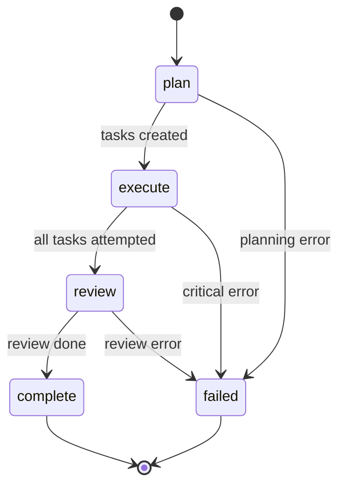
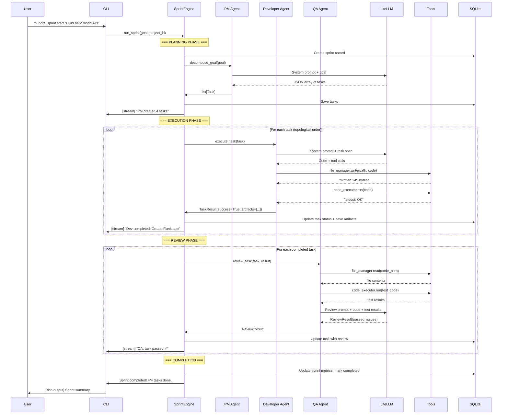

# FoundrAI — Phase 0 Technical Design Document

> **Status:** Draft  
> **Version:** 1.0  
> **Date:** 2026-02-28  
> **Scope:** Core agent orchestration engine + CLI (Weeks 1–3)

---

## Table of Contents

1. [Scope & Goals](#1-scope--goals)
2. [File/Module Structure](#2-filemodule-structure)
3. [Core Classes & Interfaces](#3-core-classes--interfaces)
4. [Data Models](#4-data-models)
5. [Database Schema](#5-database-schema)
6. [LangGraph Design](#6-langgraph-design)
7. [LiteLLM Integration](#7-litellm-integration)
8. [Sprint Flow](#8-sprint-flow)
9. [CLI Design](#9-cli-design)
10. [Configuration Loading](#10-configuration-loading)
11. [Error Handling](#11-error-handling)
12. [Testing Strategy](#12-testing-strategy)

---

## 1. Scope & Goals

### What Phase 0 Delivers

Phase 0 is the **foundation layer** — a working CLI-based agent orchestration engine that demonstrates the core sprint lifecycle with 3 agents (PM, Developer, QA) executing sequentially.

### Deliverables

| Deliverable | Description |
|---|---|
| Project scaffolding | Complete package structure, pyproject.toml, CI config |
| `foundrai init` | Creates a project directory with `foundrai.yaml` |
| `foundrai sprint start "<goal>"` | Runs a full sprint from goal → done |
| `foundrai status` | Shows current sprint state |
| `foundrai logs` | Streams agent activity to terminal |
| BaseAgent + AgentRuntime | LangGraph-based agent execution with tool access |
| 3 agent roles | ProductManager, Developer, QAEngineer |
| SprintEngine | LangGraph state machine for sprint lifecycle |
| TaskGraph | NetworkX DAG for task dependencies |
| MessageBus | In-process message passing between agents |
| SQLite persistence | Sprint state, tasks, events, artifacts |
| LiteLLM integration | Model-agnostic LLM calls |
| Sandboxed code execution | Docker-based code_executor tool |
| File manager tool | Read/write/list project files |

### Definition of Done

A user can run:

```bash
foundrai init my-project
cd my-project
export OPENAI_API_KEY="sk-..."
foundrai sprint start "Build a hello world REST API with Flask"
```

And observe in the terminal:
1. **PM** decomposes the goal into tasks with acceptance criteria
2. **Developer** writes code for each task sequentially
3. **QA** reviews and tests the code, reports pass/fail
4. Sprint completes with artifacts (code files) written to the project directory
5. All state is persisted in `.foundrai/data.db`

### What Phase 0 Does NOT Include

- Web dashboard / FastAPI server / WebSocket streaming
- Parallel task execution
- Sprint retrospectives / learning / vector memory
- Architect, Designer, DevOps roles
- Human-in-the-loop approval gates (deferred to Phase 1)
- GitHub integration
- E2B sandbox support

---

## 2. File/Module Structure

```
foundrai/
├── foundrai/
│   ├── __init__.py                    # Package version, exports
│   ├── cli.py                         # Typer CLI app (entry point)
│   ├── config.py                      # Configuration loading (foundrai.yaml → Pydantic)
│   ├── constants.py                   # Global constants
│   │
│   ├── models/
│   │   ├── __init__.py                # Re-exports all models
│   │   ├── enums.py                   # SprintStatus, TaskStatus, MessageType, etc.
│   │   ├── sprint.py                  # SprintState, SprintMetrics
│   │   ├── task.py                    # Task, TaskResult
│   │   ├── message.py                 # AgentMessage
│   │   └── artifact.py               # Artifact
│   │
│   ├── agents/
│   │   ├── __init__.py
│   │   ├── base.py                    # BaseAgent abstract class
│   │   ├── runtime.py                 # AgentRuntime (LangGraph ReAct loop)
│   │   ├── roles.py                   # AgentRole model + role registry
│   │   ├── personas/
│   │   │   ├── __init__.py
│   │   │   ├── product_manager.py     # PM persona + system prompt
│   │   │   ├── developer.py           # Dev persona + system prompt
│   │   │   └── qa_engineer.py         # QA persona + system prompt
│   │   └── llm.py                     # LiteLLM wrapper for agent calls
│   │
│   ├── orchestration/
│   │   ├── __init__.py
│   │   ├── engine.py                  # SprintEngine (LangGraph state graph)
│   │   ├── task_graph.py              # TaskGraph (NetworkX DAG)
│   │   └── message_bus.py             # MessageBus (in-process pub/sub)
│   │
│   ├── persistence/
│   │   ├── __init__.py
│   │   ├── database.py                # SQLite connection + schema init
│   │   ├── sprint_store.py            # CRUD for sprints + tasks
│   │   ├── event_log.py               # Append-only event log
│   │   └── artifact_store.py          # Artifact file storage + index
│   │
│   ├── tools/
│   │   ├── __init__.py
│   │   ├── base.py                    # BaseTool abstract class
│   │   ├── registry.py                # ToolRegistry (name → tool mapping)
│   │   ├── code_executor.py           # Docker sandboxed code execution
│   │   └── file_manager.py            # Read/write/list project files
│   │
│   └── utils/
│       ├── __init__.py
│       ├── logging.py                 # Structured logging setup
│       └── ids.py                     # ID generation (ULID or UUID)
│
├── tests/
│   ├── conftest.py                    # Shared fixtures
│   ├── test_config.py
│   ├── test_models/
│   │   ├── test_enums.py
│   │   ├── test_sprint.py
│   │   └── test_task.py
│   ├── test_agents/
│   │   ├── test_base.py
│   │   ├── test_runtime.py
│   │   └── test_roles.py
│   ├── test_orchestration/
│   │   ├── test_engine.py
│   │   ├── test_task_graph.py
│   │   └── test_message_bus.py
│   ├── test_persistence/
│   │   ├── test_database.py
│   │   ├── test_sprint_store.py
│   │   └── test_event_log.py
│   ├── test_tools/
│   │   ├── test_code_executor.py
│   │   └── test_file_manager.py
│   └── test_cli.py
│
├── docs/
├── pyproject.toml
├── foundrai.yaml                      # Default/template config
├── .env.example
└── Makefile
```

### Key Files by Size/Complexity (approximate)

| File | LOC (est.) | Complexity |
|------|-----------|------------|
| `orchestration/engine.py` | 300–400 | High — LangGraph state machine |
| `agents/runtime.py` | 200–300 | High — ReAct agent loop |
| `persistence/database.py` | 150–200 | Medium — schema + migrations |
| `cli.py` | 150–200 | Medium — Typer commands + Rich output |
| `tools/code_executor.py` | 100–150 | Medium — Docker integration |
| `config.py` | 100–150 | Medium — YAML → Pydantic |

---

## 3. Core Classes & Interfaces

### 3.1 Enums

```python
# foundrai/models/enums.py
from enum import Enum

class SprintStatus(str, Enum):
    CREATED = "created"
    PLANNING = "planning"
    EXECUTING = "executing"
    REVIEWING = "reviewing"
    COMPLETED = "completed"
    FAILED = "failed"
    CANCELLED = "cancelled"

class TaskStatus(str, Enum):
    BACKLOG = "backlog"
    IN_PROGRESS = "in_progress"
    IN_REVIEW = "in_review"
    DONE = "done"
    FAILED = "failed"
    BLOCKED = "blocked"

class MessageType(str, Enum):
    TASK_ASSIGNMENT = "task_assignment"
    TASK_RESULT = "task_result"
    CODE_REVIEW = "code_review"
    BUG_REPORT = "bug_report"
    QUESTION = "question"
    DECISION = "decision"
    STATUS_UPDATE = "status_update"
    GOAL_DECOMPOSITION = "goal_decomposition"

class AutonomyLevel(str, Enum):
    AUTO_APPROVE = "auto_approve"
    NOTIFY = "notify"
    REQUIRE_APPROVAL = "require_approval"
    BLOCK = "block"

class AgentRoleName(str, Enum):
    PRODUCT_MANAGER = "product_manager"
    DEVELOPER = "developer"
    QA_ENGINEER = "qa_engineer"
    ARCHITECT = "architect"       # Phase 2+
    DESIGNER = "designer"         # Phase 2+
    DEVOPS = "devops"             # Phase 2+
```

### 3.2 AgentRole

```python
# foundrai/agents/roles.py
from pydantic import BaseModel, Field

class AgentRole(BaseModel):
    """Defines an agent's identity, capabilities, and constraints."""
    
    name: AgentRoleName
    display_name: str                           # "Product Manager"
    persona: str                                # System prompt (multi-line)
    skills: list[str]                           # ["goal_decomposition", "story_writing"]
    tools: list[str]                            # ["file_manager", "web_search"]
    default_model: str                          # "anthropic/claude-sonnet-4-20250514"
    autonomy_level: AutonomyLevel = AutonomyLevel.NOTIFY
    max_tokens_per_action: int = 4096
    persona_override: str | None = None         # From foundrai.yaml


# Role Registry — pre-built roles
ROLE_REGISTRY: dict[AgentRoleName, AgentRole] = {}

def register_role(role: AgentRole) -> None:
    """Register a role in the global registry."""
    ROLE_REGISTRY[role.name] = role

def get_role(name: AgentRoleName) -> AgentRole:
    """Retrieve a role by name. Raises KeyError if not found."""
    return ROLE_REGISTRY[name]

def get_enabled_roles(config: "FoundrAIConfig") -> list[AgentRole]:
    """Return roles enabled in the project configuration."""
    ...
```

### 3.3 BaseAgent

```python
# foundrai/agents/base.py
from abc import ABC, abstractmethod
from foundrai.models import AgentMessage, Task, TaskResult, Artifact

class BaseAgent(ABC):
    """Abstract base class for all FoundrAI agents."""
    
    def __init__(
        self,
        role: AgentRole,
        model: str,                              # LiteLLM model string (overridden by config)
        tools: list["BaseTool"],
        message_bus: "MessageBus",
        sprint_context: "SprintContext",
    ) -> None:
        self.role = role
        self.model = model
        self.tools = tools
        self.message_bus = message_bus
        self.sprint_context = sprint_context
        self.working_memory: list[AgentMessage] = []
    
    @property
    def agent_id(self) -> str:
        """Unique identifier: role_name for Phase 0 (single instance per role)."""
        return self.role.name.value
    
    @abstractmethod
    async def execute_task(self, task: Task) -> TaskResult:
        """Execute a single task and return the result.
        
        This is the main entry point called by the SprintEngine.
        Implementations should:
        1. Build the prompt from task + sprint context
        2. Run the LLM via AgentRuntime
        3. Process tool calls
        4. Return structured TaskResult
        """
        ...
    
    @abstractmethod
    async def decompose_goal(self, goal: str) -> list[Task]:
        """Decompose a high-level goal into tasks.
        
        Only meaningful for PM role. Other roles should raise NotImplementedError.
        """
        ...
    
    @abstractmethod
    async def review_task(self, task: Task, result: TaskResult) -> "ReviewResult":
        """Review a completed task result.
        
        Only meaningful for QA role. Other roles should raise NotImplementedError.
        """
        ...
    
    async def send_message(self, message: AgentMessage) -> None:
        """Send a message through the MessageBus."""
        await self.message_bus.publish(message)
    
    async def receive_messages(self) -> list[AgentMessage]:
        """Receive pending messages from the MessageBus."""
        return await self.message_bus.consume(self.agent_id)
    
    def get_system_prompt(self) -> str:
        """Build the system prompt from role persona + sprint context."""
        persona = self.role.persona_override or self.role.persona
        context = self.sprint_context.to_prompt_string()
        return f"{persona}\n\n## Current Sprint Context\n{context}"
```

### 3.4 Concrete Agent Implementations

```python
# foundrai/agents/personas/product_manager.py

class ProductManagerAgent(BaseAgent):
    """PM agent — decomposes goals into tasks with acceptance criteria."""
    
    PERSONA = """You are a senior Product Manager at a startup. You excel at breaking down
ambiguous goals into clear, actionable tasks with acceptance criteria.

When given a goal, you MUST return a JSON array of tasks. Each task has:
- title: Short descriptive title
- description: Detailed description of what to build
- acceptance_criteria: List of specific, testable criteria
- dependencies: List of task titles this depends on (empty for independent tasks)
- assigned_to: "developer" or "qa_engineer"
- priority: 1 (highest) to 5 (lowest)

Think in terms of user value. Prioritize ruthlessly. Keep the task count minimal but sufficient."""
    
    async def decompose_goal(self, goal: str) -> list[Task]:
        """Call LLM to decompose goal into a structured task list."""
        messages = [
            {"role": "system", "content": self.get_system_prompt()},
            {"role": "user", "content": f"Decompose this goal into tasks:\n\n{goal}"},
        ]
        response = await self._call_llm(messages, response_format="json")
        tasks = self._parse_tasks(response)
        
        # Publish decomposition message
        await self.send_message(AgentMessage(
            type=MessageType.GOAL_DECOMPOSITION,
            from_agent=self.agent_id,
            to_agent=None,
            content=f"Decomposed goal into {len(tasks)} tasks",
            metadata={"task_count": len(tasks), "tasks": [t.title for t in tasks]},
        ))
        return tasks
    
    async def execute_task(self, task: Task) -> TaskResult:
        raise NotImplementedError("PM does not execute implementation tasks")
    
    async def review_task(self, task: Task, result: TaskResult) -> "ReviewResult":
        raise NotImplementedError("PM does not review tasks in Phase 0")
```

```python
# foundrai/agents/personas/developer.py

class DeveloperAgent(BaseAgent):
    """Developer agent — writes code from task specs."""
    
    PERSONA = """You are a senior software developer. You write clean, well-documented,
production-quality code. You follow best practices and include error handling.

When given a task, you:
1. Analyze the requirements and acceptance criteria
2. Plan your approach
3. Write the code using the available tools
4. Use the file_manager tool to write files to the project
5. Use the code_executor tool to verify the code runs

Return a summary of what you built and the files you created/modified."""
    
    async def execute_task(self, task: Task) -> TaskResult:
        """Execute a development task using tools."""
        messages = [
            {"role": "system", "content": self.get_system_prompt()},
            {"role": "user", "content": self._build_task_prompt(task)},
        ]
        # Run the ReAct loop via AgentRuntime
        result = await self.runtime.run(messages, tools=self.tools)
        
        return TaskResult(
            task_id=task.id,
            agent_id=self.agent_id,
            success=result.success,
            output=result.output,
            artifacts=result.artifacts,
            tokens_used=result.tokens_used,
        )
    
    def _build_task_prompt(self, task: Task) -> str:
        return f"""## Task: {task.title}

**Description:** {task.description}

**Acceptance Criteria:**
{chr(10).join(f'- {ac}' for ac in task.acceptance_criteria)}

**Project directory:** {self.sprint_context.project_path}

Implement this task. Write all files to the project directory using the file_manager tool.
Test your code using the code_executor tool before marking as done."""
    
    async def decompose_goal(self, goal: str) -> list[Task]:
        raise NotImplementedError
    
    async def review_task(self, task: Task, result: TaskResult) -> "ReviewResult":
        raise NotImplementedError
```

```python
# foundrai/agents/personas/qa_engineer.py

class QAEngineerAgent(BaseAgent):
    """QA agent — reviews code and runs tests."""
    
    PERSONA = """You are a senior QA engineer. You review code for bugs, edge cases,
and adherence to acceptance criteria. You write and run tests.

When reviewing a task:
1. Read the acceptance criteria
2. Read the generated code using file_manager
3. Check each criterion is met
4. Run the code using code_executor to verify it works
5. Report pass/fail with detailed findings

Return a structured review with: passed (bool), issues (list), suggestions (list)."""
    
    async def review_task(self, task: Task, result: TaskResult) -> "ReviewResult":
        """Review a completed task."""
        messages = [
            {"role": "system", "content": self.get_system_prompt()},
            {"role": "user", "content": self._build_review_prompt(task, result)},
        ]
        review_output = await self.runtime.run(messages, tools=self.tools)
        
        return ReviewResult(
            task_id=task.id,
            reviewer_id=self.agent_id,
            passed=review_output.parsed.get("passed", False),
            issues=review_output.parsed.get("issues", []),
            suggestions=review_output.parsed.get("suggestions", []),
        )
    
    async def execute_task(self, task: Task) -> TaskResult:
        raise NotImplementedError
    
    async def decompose_goal(self, goal: str) -> list[Task]:
        raise NotImplementedError
```

### 3.5 AgentRuntime

```python
# foundrai/agents/runtime.py
from langchain_core.messages import HumanMessage, SystemMessage, AIMessage, ToolMessage
from langgraph.prebuilt import create_react_agent
from foundrai.agents.llm import LLMClient

class AgentRuntime:
    """Executes an agent's LLM interaction loop using LangGraph ReAct pattern.
    
    Wraps LangGraph's create_react_agent with FoundrAI-specific configuration:
    - Tool binding from the ToolRegistry
    - Token tracking
    - Event emission to the EventLog
    - Structured output parsing
    """
    
    def __init__(
        self,
        llm_client: LLMClient,
        event_log: "EventLog",
        max_iterations: int = 10,
    ) -> None:
        self.llm_client = llm_client
        self.event_log = event_log
        self.max_iterations = max_iterations
    
    async def run(
        self,
        messages: list[dict],
        tools: list["BaseTool"],
        response_format: str | None = None,
    ) -> "RuntimeResult":
        """Execute the ReAct loop.
        
        Args:
            messages: Chat messages [{"role": ..., "content": ...}]
            tools: Available tools for this run
            response_format: If "json", parse the final response as JSON
            
        Returns:
            RuntimeResult with output, artifacts, and token usage
        """
        # Convert tools to LangChain tool format
        lc_tools = [tool.to_langchain_tool() for tool in tools]
        
        # Create the ReAct agent graph
        agent = create_react_agent(
            model=self.llm_client.get_model(),
            tools=lc_tools,
        )
        
        # Convert messages to LangChain format
        lc_messages = self._to_langchain_messages(messages)
        
        # Run with iteration limit
        result = await agent.ainvoke(
            {"messages": lc_messages},
            config={"recursion_limit": self.max_iterations},
        )
        
        # Extract final response
        final_message = result["messages"][-1]
        tokens_used = self._extract_token_usage(result)
        
        # Log the event
        await self.event_log.append(
            event_type="agent.run_completed",
            data={"tokens_used": tokens_used, "iterations": len(result["messages"])},
        )
        
        # Parse if JSON format requested
        parsed = None
        if response_format == "json":
            parsed = self._parse_json(final_message.content)
        
        return RuntimeResult(
            output=final_message.content,
            parsed=parsed,
            artifacts=self._collect_artifacts(result),
            tokens_used=tokens_used,
            success=True,
        )
    
    def _to_langchain_messages(self, messages: list[dict]) -> list:
        """Convert dict messages to LangChain message objects."""
        mapping = {
            "system": SystemMessage,
            "user": HumanMessage,
            "assistant": AIMessage,
        }
        return [mapping[m["role"]](content=m["content"]) for m in messages]
    
    def _parse_json(self, content: str) -> dict | list | None:
        """Extract JSON from LLM response (handles markdown code blocks)."""
        import json, re
        # Try direct parse
        try:
            return json.loads(content)
        except json.JSONDecodeError:
            pass
        # Try extracting from ```json ... ``` block
        match = re.search(r"```(?:json)?\s*\n?(.*?)\n?```", content, re.DOTALL)
        if match:
            try:
                return json.loads(match.group(1))
            except json.JSONDecodeError:
                pass
        return None


class RuntimeResult(BaseModel):
    """Result of a single AgentRuntime execution."""
    output: str
    parsed: dict | list | None = None
    artifacts: list["Artifact"] = Field(default_factory=list)
    tokens_used: int = 0
    success: bool = True
```

### 3.6 SprintEngine

```python
# foundrai/orchestration/engine.py
from langgraph.graph import StateGraph, END
from langgraph.checkpoint.sqlite.aio import AsyncSqliteSaver

class SprintEngine:
    """Orchestrates the sprint lifecycle as a LangGraph state machine.
    
    Nodes: plan → execute → review → complete
    Each node mutates SprintState and the engine persists via checkpointing.
    """
    
    def __init__(
        self,
        config: "FoundrAIConfig",
        agents: dict[AgentRoleName, BaseAgent],
        task_graph: "TaskGraph",
        message_bus: "MessageBus",
        sprint_store: "SprintStore",
        event_log: "EventLog",
        artifact_store: "ArtifactStore",
    ) -> None:
        self.config = config
        self.agents = agents
        self.task_graph = task_graph
        self.message_bus = message_bus
        self.sprint_store = sprint_store
        self.event_log = event_log
        self.artifact_store = artifact_store
        self.graph = self._build_graph()
    
    def _build_graph(self) -> StateGraph:
        """Build the LangGraph state graph. See Section 6 for full design."""
        ...
    
    async def run_sprint(self, goal: str, project_id: str) -> SprintState:
        """Execute a complete sprint from goal to completion.
        
        This is the main entry point called by the CLI.
        """
        # Initialize state
        initial_state = SprintState(
            project_id=project_id,
            sprint_id=generate_id(),
            sprint_number=await self.sprint_store.next_sprint_number(project_id),
            goal=goal,
            status=SprintStatus.CREATED,
            tasks=[],
            messages=[],
            artifacts=[],
            metrics=SprintMetrics(),
        )
        
        # Persist initial state
        await self.sprint_store.create_sprint(initial_state)
        
        # Run the graph
        checkpointer = AsyncSqliteSaver.from_conn_string(
            self.config.persistence.sqlite_path
        )
        final_state = await self.graph.ainvoke(
            initial_state,
            config={"configurable": {"thread_id": initial_state.sprint_id}},
        )
        
        return final_state
    
    async def _plan_node(self, state: SprintState) -> SprintState:
        """PLANNING node: PM decomposes goal into tasks."""
        state["status"] = SprintStatus.PLANNING
        await self._emit_status_change(state)
        
        pm = self.agents[AgentRoleName.PRODUCT_MANAGER]
        tasks = await pm.decompose_goal(state["goal"])
        
        # Build the TaskGraph from dependencies
        for task in tasks:
            self.task_graph.add_task(task, depends_on=task.dependencies)
        
        state["tasks"] = tasks
        await self.sprint_store.update_tasks(state["sprint_id"], tasks)
        return state
    
    async def _execute_node(self, state: SprintState) -> SprintState:
        """EXECUTING node: Developer works through tasks sequentially."""
        state["status"] = SprintStatus.EXECUTING
        await self._emit_status_change(state)
        
        dev = self.agents[AgentRoleName.DEVELOPER]
        execution_order = self.task_graph.get_execution_order()
        
        for task in execution_order:
            if task.assigned_to != AgentRoleName.DEVELOPER:
                continue
            
            task.status = TaskStatus.IN_PROGRESS
            await self._emit_task_status(task)
            
            result = await dev.execute_task(task)
            
            task.result = result
            task.status = TaskStatus.IN_REVIEW if result.success else TaskStatus.FAILED
            
            # Store artifacts
            for artifact in result.artifacts:
                await self.artifact_store.save(artifact)
                state["artifacts"].append(artifact)
            
            await self._emit_task_status(task)
            self.task_graph.mark_completed(task.id)
        
        return state
    
    async def _review_node(self, state: SprintState) -> SprintState:
        """REVIEWING node: QA reviews all completed tasks."""
        state["status"] = SprintStatus.REVIEWING
        await self._emit_status_change(state)
        
        qa = self.agents[AgentRoleName.QA_ENGINEER]
        
        for task in state["tasks"]:
            if task.status != TaskStatus.IN_REVIEW:
                continue
            
            review = await qa.review_task(task, task.result)
            
            if review.passed:
                task.status = TaskStatus.DONE
            else:
                task.status = TaskStatus.FAILED
                # In Phase 0: just mark failed, no retry loop
                task.review_issues = review.issues
            
            await self._emit_task_status(task)
        
        return state
    
    async def _complete_node(self, state: SprintState) -> SprintState:
        """COMPLETED node: Finalize sprint metrics."""
        state["status"] = SprintStatus.COMPLETED
        
        # Calculate metrics
        total = len(state["tasks"])
        done = sum(1 for t in state["tasks"] if t.status == TaskStatus.DONE)
        failed = sum(1 for t in state["tasks"] if t.status == TaskStatus.FAILED)
        
        state["metrics"] = SprintMetrics(
            total_tasks=total,
            completed_tasks=done,
            failed_tasks=failed,
            total_tokens=sum(
                t.result.tokens_used for t in state["tasks"] if t.result
            ),
        )
        
        await self.sprint_store.complete_sprint(state)
        await self._emit_status_change(state)
        return state
    
    async def _emit_status_change(self, state: SprintState) -> None:
        await self.event_log.append(
            event_type="sprint.status_changed",
            data={"sprint_id": state["sprint_id"], "status": state["status"]},
        )
    
    async def _emit_task_status(self, task: Task) -> None:
        await self.event_log.append(
            event_type="task.status_changed",
            data={"task_id": task.id, "status": task.status},
        )
```

### 3.7 TaskGraph

```python
# foundrai/orchestration/task_graph.py
import networkx as nx
from foundrai.models import Task, TaskStatus

class TaskGraph:
    """DAG of tasks with dependency tracking.
    
    Uses NetworkX DiGraph internally. Each node is a task_id,
    edges represent "depends_on" relationships (edge from dependency → dependent).
    """
    
    def __init__(self) -> None:
        self._graph: nx.DiGraph = nx.DiGraph()
        self._tasks: dict[str, Task] = {}
    
    def add_task(self, task: Task, depends_on: list[str] | None = None) -> None:
        """Add a task to the graph.
        
        Args:
            task: The task to add
            depends_on: List of task IDs this task depends on
            
        Raises:
            ValueError: If adding this edge would create a cycle
        """
        self._graph.add_node(task.id)
        self._tasks[task.id] = task
        
        for dep_id in (depends_on or []):
            self._graph.add_edge(dep_id, task.id)
        
        if not nx.is_directed_acyclic_graph(self._graph):
            # Rollback
            self._graph.remove_node(task.id)
            del self._tasks[task.id]
            raise ValueError(f"Adding task {task.id} would create a cycle")
    
    def get_ready_tasks(self) -> list[Task]:
        """Return tasks whose dependencies are all completed."""
        ready = []
        for task_id in self._graph.nodes:
            task = self._tasks[task_id]
            if task.status != TaskStatus.BACKLOG:
                continue
            predecessors = list(self._graph.predecessors(task_id))
            if all(self._tasks[p].status == TaskStatus.DONE for p in predecessors):
                ready.append(task)
        return ready
    
    def get_execution_order(self) -> list[Task]:
        """Return topological sort of all tasks (sequential execution order)."""
        order = list(nx.topological_sort(self._graph))
        return [self._tasks[tid] for tid in order]
    
    def mark_completed(self, task_id: str) -> None:
        """Mark a task as completed in the graph."""
        self._tasks[task_id].status = TaskStatus.DONE
    
    def get_critical_path(self) -> list[Task]:
        """Return the longest path through the DAG (critical path)."""
        try:
            path = nx.dag_longest_path(self._graph)
            return [self._tasks[tid] for tid in path]
        except nx.NetworkXError:
            return []
    
    def visualize(self) -> dict:
        """Return graph data for frontend visualization.
        
        Returns:
            {"nodes": [...], "edges": [...]} suitable for React Flow
        """
        nodes = [
            {"id": tid, "data": {"label": t.title, "status": t.status.value}}
            for tid, t in self._tasks.items()
        ]
        edges = [
            {"source": u, "target": v}
            for u, v in self._graph.edges
        ]
        return {"nodes": nodes, "edges": edges}
    
    @property
    def task_count(self) -> int:
        return len(self._tasks)
    
    def get_task(self, task_id: str) -> Task:
        return self._tasks[task_id]
```

### 3.8 MessageBus

```python
# foundrai/orchestration/message_bus.py
import asyncio
from collections import defaultdict
from foundrai.models import AgentMessage

class MessageBus:
    """In-process async message bus for inter-agent communication.
    
    Phase 0: Simple queue-based pub/sub. Messages are stored in per-agent
    queues and consumed FIFO. Broadcast messages go to all agents.
    
    All messages are also forwarded to the EventLog and any registered
    listeners (for CLI streaming).
    """
    
    def __init__(self, event_log: "EventLog") -> None:
        self._queues: dict[str, asyncio.Queue[AgentMessage]] = defaultdict(asyncio.Queue)
        self._listeners: list[callable] = []
        self._event_log = event_log
        self._all_messages: list[AgentMessage] = []
    
    async def publish(self, message: AgentMessage) -> None:
        """Publish a message. Routes to specific agent or broadcasts to all."""
        self._all_messages.append(message)
        
        # Log to event store
        await self._event_log.append(
            event_type="agent.message",
            data=message.model_dump(),
        )
        
        # Notify listeners (for CLI streaming)
        for listener in self._listeners:
            await listener(message)
        
        if message.to_agent:
            # Direct message
            await self._queues[message.to_agent].put(message)
        else:
            # Broadcast to all queues (except sender)
            for agent_id, queue in self._queues.items():
                if agent_id != message.from_agent:
                    await queue.put(message)
    
    async def consume(self, agent_id: str) -> list[AgentMessage]:
        """Consume all pending messages for an agent (non-blocking)."""
        queue = self._queues[agent_id]
        messages = []
        while not queue.empty():
            messages.append(queue.get_nowait())
        return messages
    
    def register_listener(self, callback: callable) -> None:
        """Register a callback for all messages (used by CLI for live streaming)."""
        self._listeners.append(callback)
    
    def unregister_listener(self, callback: callable) -> None:
        self._listeners.remove(callback)
    
    def get_history(self) -> list[AgentMessage]:
        """Return all messages in order."""
        return list(self._all_messages)
    
    def register_agent(self, agent_id: str) -> None:
        """Ensure a queue exists for this agent."""
        _ = self._queues[agent_id]
```

### 3.9 Tool System

```python
# foundrai/tools/base.py
from abc import ABC, abstractmethod
from pydantic import BaseModel
from langchain_core.tools import StructuredTool

class ToolInput(BaseModel):
    """Base class for tool input schemas. Subclass per tool."""
    pass

class ToolOutput(BaseModel):
    """Standard tool output."""
    success: bool
    output: str
    error: str | None = None

class BaseTool(ABC):
    """Abstract base for all FoundrAI tools."""
    
    name: str
    description: str
    input_schema: type[ToolInput]
    
    @abstractmethod
    async def execute(self, input: ToolInput) -> ToolOutput:
        """Execute the tool with validated input."""
        ...
    
    def to_langchain_tool(self) -> StructuredTool:
        """Convert to LangChain StructuredTool for use in ReAct agent."""
        return StructuredTool.from_function(
            coroutine=self._execute_wrapper,
            name=self.name,
            description=self.description,
            args_schema=self.input_schema,
        )
    
    async def _execute_wrapper(self, **kwargs) -> str:
        """Wrapper that converts kwargs → ToolInput → ToolOutput → str."""
        tool_input = self.input_schema(**kwargs)
        result = await self.execute(tool_input)
        if result.success:
            return result.output
        else:
            return f"Error: {result.error}"
```

```python
# foundrai/tools/code_executor.py

class CodeExecutorInput(ToolInput):
    code: str                          # Code to execute
    language: str = "python"           # python | javascript | bash
    timeout_seconds: int = 30

class CodeExecutor(BaseTool):
    """Execute code in a sandboxed Docker container.
    
    Creates a temporary container, mounts the code, runs it, 
    captures stdout/stderr, and returns the result.
    """
    
    name = "code_executor"
    description = "Execute code in a sandboxed environment. Returns stdout and stderr."
    input_schema = CodeExecutorInput
    
    DOCKER_IMAGES = {
        "python": "python:3.11-slim",
        "javascript": "node:20-slim",
        "bash": "bash:5",
    }
    
    def __init__(self, sandbox_config: "SandboxConfig") -> None:
        self.timeout = sandbox_config.timeout_seconds
        self.max_memory = sandbox_config.max_memory_mb
    
    async def execute(self, input: CodeExecutorInput) -> ToolOutput:
        """Run code in Docker container."""
        import asyncio
        
        image = self.DOCKER_IMAGES.get(input.language)
        if not image:
            return ToolOutput(success=False, output="", error=f"Unsupported language: {input.language}")
        
        # Write code to temp file
        import tempfile, os
        with tempfile.NamedTemporaryFile(mode="w", suffix=self._ext(input.language), delete=False) as f:
            f.write(input.code)
            code_path = f.name
        
        try:
            cmd = [
                "docker", "run", "--rm",
                "--memory", f"{self.max_memory}m",
                "--network", "none",            # No network access
                "--read-only",                  # Read-only filesystem
                "--tmpfs", "/tmp:size=64m",     # Writable /tmp
                "-v", f"{code_path}:/code/main{self._ext(input.language)}:ro",
                image,
                self._run_cmd(input.language),
                f"/code/main{self._ext(input.language)}",
            ]
            
            proc = await asyncio.create_subprocess_exec(
                *cmd,
                stdout=asyncio.subprocess.PIPE,
                stderr=asyncio.subprocess.PIPE,
            )
            stdout, stderr = await asyncio.wait_for(
                proc.communicate(),
                timeout=input.timeout_seconds,
            )
            
            return ToolOutput(
                success=proc.returncode == 0,
                output=stdout.decode("utf-8", errors="replace"),
                error=stderr.decode("utf-8", errors="replace") if proc.returncode != 0 else None,
            )
        except asyncio.TimeoutError:
            return ToolOutput(success=False, output="", error="Execution timed out")
        finally:
            os.unlink(code_path)
    
    @staticmethod
    def _ext(lang: str) -> str:
        return {".python": ".py", "javascript": ".js", "bash": ".sh"}.get(lang, ".py")
    
    @staticmethod
    def _run_cmd(lang: str) -> str:
        return {"python": "python", "javascript": "node", "bash": "bash"}.get(lang, "python")
```

```python
# foundrai/tools/file_manager.py
from pathlib import Path

class FileManagerInput(ToolInput):
    action: str                        # "read" | "write" | "list" | "exists"
    path: str                          # Relative to project root
    content: str | None = None         # Required for "write"

class FileManager(BaseTool):
    """Read, write, and list files within the project directory.
    
    All paths are relative to the project root and sandboxed — 
    no access outside the project directory.
    """
    
    name = "file_manager"
    description = """Manage project files. Actions:
- read: Read file contents. Args: path
- write: Write content to file (creates dirs). Args: path, content
- list: List files in directory. Args: path (default ".")
- exists: Check if path exists. Args: path"""
    input_schema = FileManagerInput
    
    def __init__(self, project_path: Path) -> None:
        self.project_path = project_path.resolve()
    
    async def execute(self, input: FileManagerInput) -> ToolOutput:
        target = (self.project_path / input.path).resolve()
        
        # Sandbox check — prevent path traversal
        if not str(target).startswith(str(self.project_path)):
            return ToolOutput(success=False, output="", error="Path outside project directory")
        
        match input.action:
            case "read":
                return await self._read(target)
            case "write":
                return await self._write(target, input.content or "")
            case "list":
                return await self._list(target)
            case "exists":
                return ToolOutput(success=True, output=str(target.exists()))
            case _:
                return ToolOutput(success=False, output="", error=f"Unknown action: {input.action}")
    
    async def _read(self, path: Path) -> ToolOutput:
        if not path.exists():
            return ToolOutput(success=False, output="", error=f"File not found: {path.name}")
        content = path.read_text(encoding="utf-8")
        return ToolOutput(success=True, output=content)
    
    async def _write(self, path: Path, content: str) -> ToolOutput:
        path.parent.mkdir(parents=True, exist_ok=True)
        path.write_text(content, encoding="utf-8")
        return ToolOutput(success=True, output=f"Written {len(content)} bytes to {path.name}")
    
    async def _list(self, path: Path) -> ToolOutput:
        if not path.exists():
            return ToolOutput(success=False, output="", error=f"Directory not found: {path.name}")
        entries = sorted(p.name + ("/" if p.is_dir() else "") for p in path.iterdir())
        return ToolOutput(success=True, output="\n".join(entries))
```

```python
# foundrai/tools/registry.py

class ToolRegistry:
    """Maps tool names to tool instances. Used to build per-role tool sets."""
    
    def __init__(self) -> None:
        self._tools: dict[str, BaseTool] = {}
    
    def register(self, tool: BaseTool) -> None:
        self._tools[tool.name] = tool
    
    def get(self, name: str) -> BaseTool:
        if name not in self._tools:
            raise KeyError(f"Tool not found: {name}")
        return self._tools[name]
    
    def get_tools_for_role(self, role: AgentRole) -> list[BaseTool]:
        """Return tool instances matching the role's tool list."""
        return [self._tools[name] for name in role.tools if name in self._tools]
```

---

## 4. Data Models

```python
# foundrai/models/sprint.py
from pydantic import BaseModel, Field
from datetime import datetime
from typing import TypedDict

class SprintMetrics(BaseModel):
    """Metrics collected during and after a sprint."""
    total_tasks: int = 0
    completed_tasks: int = 0
    failed_tasks: int = 0
    total_tokens: int = 0
    total_llm_calls: int = 0
    duration_seconds: float = 0.0
    
    @property
    def completion_rate(self) -> float:
        return self.completed_tasks / max(self.total_tasks, 1)


class SprintState(TypedDict, total=False):
    """Sprint state managed by LangGraph.
    
    Using TypedDict (not Pydantic) because LangGraph state must be TypedDict.
    """
    project_id: str
    sprint_id: str
    sprint_number: int
    goal: str
    status: SprintStatus
    tasks: list["Task"]
    messages: list["AgentMessage"]
    artifacts: list["Artifact"]
    metrics: SprintMetrics
    created_at: str               # ISO 8601
    completed_at: str | None      # ISO 8601
    error: str | None             # Set if sprint failed
```

```python
# foundrai/models/task.py
from pydantic import BaseModel, Field
from datetime import datetime

class TaskResult(BaseModel):
    """Result of a task execution by an agent."""
    task_id: str
    agent_id: str
    success: bool
    output: str                                  # Agent's summary of what was done
    artifacts: list["Artifact"] = Field(default_factory=list)
    tokens_used: int = 0
    completed_at: datetime = Field(default_factory=datetime.utcnow)

class ReviewResult(BaseModel):
    """Result of QA review."""
    task_id: str
    reviewer_id: str
    passed: bool
    issues: list[str] = Field(default_factory=list)
    suggestions: list[str] = Field(default_factory=list)
    reviewed_at: datetime = Field(default_factory=datetime.utcnow)

class Task(BaseModel):
    """A single unit of work within a sprint."""
    id: str = Field(default_factory=lambda: generate_id())
    title: str
    description: str
    acceptance_criteria: list[str] = Field(default_factory=list)
    assigned_to: AgentRoleName = AgentRoleName.DEVELOPER
    priority: int = 3                            # 1 (highest) to 5 (lowest)
    status: TaskStatus = TaskStatus.BACKLOG
    dependencies: list[str] = Field(default_factory=list)  # Task IDs
    result: TaskResult | None = None
    review: ReviewResult | None = None
    created_at: datetime = Field(default_factory=datetime.utcnow)
    updated_at: datetime = Field(default_factory=datetime.utcnow)
    
    class Config:
        use_enum_values = True
```

```python
# foundrai/models/message.py
from pydantic import BaseModel, Field
from datetime import datetime

class AgentMessage(BaseModel):
    """A message sent between agents via the MessageBus."""
    id: str = Field(default_factory=lambda: generate_id())
    type: MessageType
    from_agent: str                              # Agent ID (role name)
    to_agent: str | None = None                  # None = broadcast
    content: str
    metadata: dict = Field(default_factory=dict)
    timestamp: datetime = Field(default_factory=datetime.utcnow)
```

```python
# foundrai/models/artifact.py
from pydantic import BaseModel, Field
from datetime import datetime

class Artifact(BaseModel):
    """A file or output generated by an agent."""
    id: str = Field(default_factory=lambda: generate_id())
    sprint_id: str
    task_id: str
    agent_id: str
    artifact_type: str                           # "code" | "test" | "document" | "config"
    file_path: str                               # Relative to project root
    content_hash: str                            # SHA-256 of content
    size_bytes: int
    created_at: datetime = Field(default_factory=datetime.utcnow)
```

---

## 5. Database Schema

SQLite database at `.foundrai/data.db`. Managed via `foundrai/persistence/database.py`.

```sql
-- Schema version tracking
CREATE TABLE IF NOT EXISTS schema_version (
    version INTEGER PRIMARY KEY,
    applied_at TEXT NOT NULL DEFAULT (datetime('now'))
);

-- Sprints
CREATE TABLE IF NOT EXISTS sprints (
    sprint_id TEXT PRIMARY KEY,
    project_id TEXT NOT NULL,
    sprint_number INTEGER NOT NULL,
    goal TEXT NOT NULL,
    status TEXT NOT NULL DEFAULT 'created',       -- SprintStatus enum value
    metrics_json TEXT DEFAULT '{}',               -- JSON SprintMetrics
    error TEXT,
    created_at TEXT NOT NULL DEFAULT (datetime('now')),
    completed_at TEXT
);
CREATE INDEX idx_sprints_project ON sprints(project_id);
CREATE INDEX idx_sprints_status ON sprints(status);

-- Tasks
CREATE TABLE IF NOT EXISTS tasks (
    task_id TEXT PRIMARY KEY,
    sprint_id TEXT NOT NULL REFERENCES sprints(sprint_id),
    title TEXT NOT NULL,
    description TEXT NOT NULL DEFAULT '',
    acceptance_criteria_json TEXT DEFAULT '[]',    -- JSON array of strings
    assigned_to TEXT NOT NULL,                     -- AgentRoleName value
    priority INTEGER NOT NULL DEFAULT 3,
    status TEXT NOT NULL DEFAULT 'backlog',        -- TaskStatus enum value
    dependencies_json TEXT DEFAULT '[]',           -- JSON array of task_ids
    result_json TEXT,                              -- JSON TaskResult (nullable)
    review_json TEXT,                              -- JSON ReviewResult (nullable)
    created_at TEXT NOT NULL DEFAULT (datetime('now')),
    updated_at TEXT NOT NULL DEFAULT (datetime('now'))
);
CREATE INDEX idx_tasks_sprint ON tasks(sprint_id);
CREATE INDEX idx_tasks_status ON tasks(status);
CREATE INDEX idx_tasks_assigned ON tasks(assigned_to);

-- Agent Messages
CREATE TABLE IF NOT EXISTS messages (
    message_id TEXT PRIMARY KEY,
    sprint_id TEXT NOT NULL,
    type TEXT NOT NULL,                            -- MessageType enum value
    from_agent TEXT NOT NULL,
    to_agent TEXT,                                 -- NULL = broadcast
    content TEXT NOT NULL,
    metadata_json TEXT DEFAULT '{}',
    timestamp TEXT NOT NULL DEFAULT (datetime('now'))
);
CREATE INDEX idx_messages_sprint ON messages(sprint_id);
CREATE INDEX idx_messages_from ON messages(from_agent);
CREATE INDEX idx_messages_type ON messages(type);

-- Artifacts
CREATE TABLE IF NOT EXISTS artifacts (
    artifact_id TEXT PRIMARY KEY,
    sprint_id TEXT NOT NULL REFERENCES sprints(sprint_id),
    task_id TEXT NOT NULL REFERENCES tasks(task_id),
    agent_id TEXT NOT NULL,
    artifact_type TEXT NOT NULL,
    file_path TEXT NOT NULL,
    content_hash TEXT NOT NULL,
    size_bytes INTEGER NOT NULL DEFAULT 0,
    created_at TEXT NOT NULL DEFAULT (datetime('now'))
);
CREATE INDEX idx_artifacts_sprint ON artifacts(sprint_id);
CREATE INDEX idx_artifacts_task ON artifacts(task_id);

-- Event Log (append-only)
CREATE TABLE IF NOT EXISTS events (
    event_id INTEGER PRIMARY KEY AUTOINCREMENT,
    event_type TEXT NOT NULL,                      -- e.g., "sprint.status_changed"
    data_json TEXT NOT NULL,                       -- JSON payload
    timestamp TEXT NOT NULL DEFAULT (datetime('now'))
);
CREATE INDEX idx_events_type ON events(event_type);
CREATE INDEX idx_events_timestamp ON events(timestamp);
```

### Persistence Classes

```python
# foundrai/persistence/database.py

class Database:
    """SQLite database connection and schema management."""
    
    def __init__(self, db_path: str) -> None:
        self.db_path = db_path
        self._connection: aiosqlite.Connection | None = None
    
    async def connect(self) -> None:
        """Open connection and ensure schema exists."""
        import aiosqlite
        Path(self.db_path).parent.mkdir(parents=True, exist_ok=True)
        self._connection = await aiosqlite.connect(self.db_path)
        self._connection.row_factory = aiosqlite.Row
        await self._connection.execute("PRAGMA journal_mode=WAL")
        await self._connection.execute("PRAGMA foreign_keys=ON")
        await self._init_schema()
    
    async def _init_schema(self) -> None:
        """Create tables if they don't exist."""
        await self._connection.executescript(SCHEMA_SQL)
        await self._connection.commit()
    
    async def close(self) -> None:
        if self._connection:
            await self._connection.close()
    
    @property
    def conn(self) -> aiosqlite.Connection:
        assert self._connection is not None, "Database not connected"
        return self._connection
```

```python
# foundrai/persistence/sprint_store.py

class SprintStore:
    """CRUD operations for sprints and tasks."""
    
    def __init__(self, db: Database) -> None:
        self.db = db
    
    async def create_sprint(self, state: SprintState) -> None: ...
    async def get_sprint(self, sprint_id: str) -> SprintState | None: ...
    async def update_sprint_status(self, sprint_id: str, status: SprintStatus) -> None: ...
    async def complete_sprint(self, state: SprintState) -> None: ...
    async def next_sprint_number(self, project_id: str) -> int: ...
    
    async def create_task(self, sprint_id: str, task: Task) -> None: ...
    async def update_task(self, task: Task) -> None: ...
    async def get_tasks(self, sprint_id: str) -> list[Task]: ...
    async def update_tasks(self, sprint_id: str, tasks: list[Task]) -> None: ...
```

```python
# foundrai/persistence/event_log.py

class EventLog:
    """Append-only event log for full audit trail."""
    
    def __init__(self, db: Database) -> None:
        self.db = db
        self._listeners: list[callable] = []
    
    async def append(self, event_type: str, data: dict) -> int:
        """Append an event and return its ID."""
        import json
        cursor = await self.db.conn.execute(
            "INSERT INTO events (event_type, data_json) VALUES (?, ?)",
            (event_type, json.dumps(data, default=str)),
        )
        await self.db.conn.commit()
        
        # Notify listeners
        for listener in self._listeners:
            await listener(event_type, data)
        
        return cursor.lastrowid
    
    async def query(
        self,
        event_type: str | None = None,
        since: str | None = None,
        limit: int = 100,
    ) -> list[dict]:
        """Query events with optional filters."""
        ...
    
    def register_listener(self, callback: callable) -> None:
        self._listeners.append(callback)
```

---

## 6. LangGraph Design

### State Graph



### Implementation

```python
# foundrai/orchestration/engine.py (graph construction)

from langgraph.graph import StateGraph, END
from foundrai.models.sprint import SprintState, SprintStatus

def _build_graph(self) -> StateGraph:
    """Construct the LangGraph sprint state machine."""
    
    graph = StateGraph(SprintState)
    
    # Add nodes
    graph.add_node("plan", self._plan_node)
    graph.add_node("execute", self._execute_node)
    graph.add_node("review", self._review_node)
    graph.add_node("complete", self._complete_node)
    graph.add_node("failed", self._failed_node)
    
    # Set entry point
    graph.set_entry_point("plan")
    
    # Add edges with conditional routing
    graph.add_conditional_edges(
        "plan",
        self._route_after_plan,
        {
            "execute": "execute",
            "failed": "failed",
        },
    )
    
    graph.add_conditional_edges(
        "execute",
        self._route_after_execute,
        {
            "review": "review",
            "failed": "failed",
        },
    )
    
    graph.add_conditional_edges(
        "review",
        self._route_after_review,
        {
            "complete": "complete",
            "failed": "failed",
        },
    )
    
    graph.add_edge("complete", END)
    graph.add_edge("failed", END)
    
    return graph.compile(checkpointer=self._checkpointer)


# Routing functions
def _route_after_plan(self, state: SprintState) -> str:
    """Route after planning: execute if tasks exist, fail otherwise."""
    if state.get("error"):
        return "failed"
    if not state.get("tasks"):
        state["error"] = "Planning produced no tasks"
        return "failed"
    return "execute"

def _route_after_execute(self, state: SprintState) -> str:
    """Route after execution: always go to review (even with failures)."""
    if state.get("error"):
        return "failed"
    return "review"

def _route_after_review(self, state: SprintState) -> str:
    """Route after review: always complete (Phase 0 has no retry loops)."""
    return "complete"

async def _failed_node(self, state: SprintState) -> SprintState:
    """Handle sprint failure."""
    state["status"] = SprintStatus.FAILED
    await self.sprint_store.update_sprint_status(
        state["sprint_id"], SprintStatus.FAILED
    )
    await self._emit_status_change(state)
    return state
```

### Checkpointing

LangGraph checkpointing is used to persist sprint state after each node, enabling crash recovery:

```python
from langgraph.checkpoint.sqlite.aio import AsyncSqliteSaver

# Reuse the same SQLite database
checkpointer = AsyncSqliteSaver.from_conn_string(config.persistence.sqlite_path)
```

If the process crashes mid-sprint, rerunning `foundrai sprint start` with the same sprint ID will resume from the last checkpoint.

---

## 7. LiteLLM Integration

```python
# foundrai/agents/llm.py
import litellm
from pydantic import BaseModel

class LLMConfig(BaseModel):
    """Per-agent LLM configuration."""
    model: str                          # LiteLLM model string: "anthropic/claude-sonnet-4-20250514"
    max_tokens: int = 4096
    temperature: float = 0.7

class LLMClient:
    """Thin wrapper around LiteLLM for model-agnostic LLM calls.
    
    Handles:
    - Model routing (per-agent model from config)
    - Token tracking
    - Error handling and retries
    - Structured output (JSON mode) when requested
    """
    
    def __init__(self, config: LLMConfig) -> None:
        self.config = config
        self.total_tokens_used: int = 0
    
    async def completion(
        self,
        messages: list[dict],
        temperature: float | None = None,
        max_tokens: int | None = None,
        response_format: dict | None = None,
    ) -> "LLMResponse":
        """Call the LLM via LiteLLM.
        
        Args:
            messages: [{"role": "system"|"user"|"assistant", "content": "..."}]
            temperature: Override default temperature
            max_tokens: Override default max tokens
            response_format: {"type": "json_object"} for JSON mode
        
        Returns:
            LLMResponse with content and usage stats
        """
        response = await litellm.acompletion(
            model=self.config.model,
            messages=messages,
            temperature=temperature or self.config.temperature,
            max_tokens=max_tokens or self.config.max_tokens,
            response_format=response_format,
        )
        
        usage = response.usage
        self.total_tokens_used += usage.total_tokens
        
        return LLMResponse(
            content=response.choices[0].message.content,
            prompt_tokens=usage.prompt_tokens,
            completion_tokens=usage.completion_tokens,
            total_tokens=usage.total_tokens,
            model=response.model,
        )
    
    def get_model(self):
        """Return a LangChain-compatible chat model backed by LiteLLM.
        
        Used by AgentRuntime to create the ReAct agent.
        """
        from langchain_community.chat_models import ChatLiteLLM
        return ChatLiteLLM(
            model=self.config.model,
            max_tokens=self.config.max_tokens,
            temperature=self.config.temperature,
        )


class LLMResponse(BaseModel):
    content: str
    prompt_tokens: int = 0
    completion_tokens: int = 0
    total_tokens: int = 0
    model: str = ""
```

### Model Routing

Each agent gets its own `LLMClient` instance based on `foundrai.yaml`:

```python
# In sprint initialization:
def create_agents(config: FoundrAIConfig, ...) -> dict[AgentRoleName, BaseAgent]:
    agents = {}
    for role_name, role_config in config.team.items():
        if not role_config.enabled:
            continue
        
        role = get_role(AgentRoleName(role_name))
        llm_config = LLMConfig(
            model=role_config.model,                        # From foundrai.yaml
            max_tokens=role_config.max_tokens_per_action,
        )
        llm_client = LLMClient(llm_config)
        runtime = AgentRuntime(llm_client=llm_client, event_log=event_log)
        
        # Build agent with role-specific tools
        agent_class = AGENT_CLASS_MAP[AgentRoleName(role_name)]
        agents[AgentRoleName(role_name)] = agent_class(
            role=role,
            model=role_config.model,
            tools=tool_registry.get_tools_for_role(role),
            message_bus=message_bus,
            sprint_context=sprint_context,
        )
    return agents
```

---

## 8. Sprint Flow

### Complete Phase 0 Sprint Sequence



### Detailed Step-by-Step

**1. Initialization** (`foundrai sprint start "Build a hello world REST API with Flask"`)

```
1. CLI parses args, loads foundrai.yaml → FoundrAIConfig
2. Database.connect() — opens/creates .foundrai/data.db
3. Create ToolRegistry, register code_executor + file_manager
4. Create MessageBus + EventLog
5. Create agents: PM, Developer, QA (each with own LLMClient)
6. Build SprintEngine with all components
7. Call engine.run_sprint(goal, project_id)
```

**2. Planning** (PM Agent)

```
1. Engine sets status = PLANNING
2. PM.decompose_goal(goal) called
3. PM builds prompt: persona + "Decompose this goal into tasks"
4. LLM returns JSON:
   [
     {"title": "Create Flask app structure", "description": "...", "acceptance_criteria": ["..."], "assigned_to": "developer", "priority": 1, "dependencies": []},
     {"title": "Add GET /hello endpoint", "description": "...", "acceptance_criteria": ["..."], "assigned_to": "developer", "priority": 1, "dependencies": ["Create Flask app structure"]},
     {"title": "Add error handling", "description": "...", "acceptance_criteria": ["..."], "assigned_to": "developer", "priority": 2, "dependencies": ["Add GET /hello endpoint"]},
     {"title": "Write tests", "description": "...", "acceptance_criteria": ["..."], "assigned_to": "developer", "priority": 2, "dependencies": ["Add GET /hello endpoint"]}
   ]
5. PM parses JSON → list[Task], resolves dependency references (title → task_id)
6. TaskGraph built from tasks + dependencies
7. Tasks persisted to DB
```

**3. Execution** (Developer Agent)

```
1. Engine sets status = EXECUTING
2. TaskGraph.get_execution_order() → topologically sorted list
3. For each task assigned to developer:
   a. Set task.status = IN_PROGRESS
   b. Developer.execute_task(task)
   c. AgentRuntime runs ReAct loop:
      - LLM sees: task spec + acceptance criteria
      - LLM decides: call file_manager.write("app.py", "...")
      - Tool executes, result returned to LLM
      - LLM decides: call code_executor.run("python app.py")
      - Tool executes, result returned to LLM
      - LLM produces final summary
   d. TaskResult created with artifacts list
   e. Set task.status = IN_REVIEW
   f. Artifacts saved via ArtifactStore
```

**4. Review** (QA Agent)

```
1. Engine sets status = REVIEWING
2. For each task in IN_REVIEW status:
   a. QA.review_task(task, result)
   b. QA reads the code files using file_manager
   c. QA writes and runs tests using code_executor
   d. QA evaluates against acceptance criteria
   e. Returns ReviewResult(passed=True/False, issues=[...])
   f. Task marked DONE (passed) or FAILED (not passed)
```

**5. Completion**

```
1. Engine sets status = COMPLETED
2. SprintMetrics calculated
3. Sprint record updated in DB
4. Summary printed to CLI
```

---

## 9. CLI Design

```python
# foundrai/cli.py
import typer
from rich.console import Console
from rich.table import Table
from rich.live import Live
from rich.panel import Panel

app = typer.Typer(
    name="foundrai",
    help="FoundrAI — Your AI-Powered Founding Team",
    no_args_is_help=True,
)
console = Console()


@app.command()
def init(
    name: str = typer.Argument(..., help="Project name"),
    path: str = typer.Option(".", help="Directory to create project in"),
) -> None:
    """Initialize a new FoundrAI project.
    
    Creates:
      <name>/
        foundrai.yaml    — Project configuration
        .foundrai/       — Data directory (DB, logs, artifacts)
        .env.example     — Environment variable template
    """
    ...


@app.command()
def sprint_start(
    goal: str = typer.Argument(..., help="Sprint goal (what to build)"),
    project_dir: str = typer.Option(".", "--project", "-p", help="Project directory"),
    verbose: bool = typer.Option(False, "--verbose", "-v", help="Show detailed agent output"),
    no_stream: bool = typer.Option(False, "--no-stream", help="Don't stream live output"),
) -> None:
    """Start a new sprint with the given goal.
    
    Example:
        foundrai sprint-start "Build a REST API for a todo app with Flask"
    """
    import asyncio
    
    config = load_config(project_dir)
    
    # Register live output callback
    async def on_event(event_type: str, data: dict):
        _print_event(event_type, data, verbose)
    
    async def run():
        engine = await create_engine(config)
        engine.event_log.register_listener(on_event)
        result = await engine.run_sprint(goal, project_id=config.project.name)
        _print_summary(result)
    
    asyncio.run(run())


@app.command()
def status(
    project_dir: str = typer.Option(".", "--project", "-p"),
) -> None:
    """Show current sprint status.
    
    Output:
        Sprint #1: "Build a hello world API"
        Status: executing
        Tasks: 2/4 done, 1 in progress, 1 backlog
        Tokens used: 12,450
    """
    import asyncio
    asyncio.run(_show_status(project_dir))


@app.command()
def logs(
    project_dir: str = typer.Option(".", "--project", "-p"),
    agent: str = typer.Option(None, "--agent", "-a", help="Filter by agent role"),
    event_type: str = typer.Option(None, "--type", "-t", help="Filter by event type"),
    limit: int = typer.Option(50, "--limit", "-n", help="Number of events to show"),
    follow: bool = typer.Option(False, "--follow", "-f", help="Stream new events"),
) -> None:
    """Show or stream agent activity logs.
    
    Examples:
        foundrai logs                      # Last 50 events
        foundrai logs -a developer         # Only developer events
        foundrai logs -f                   # Stream live
        foundrai logs -t agent.message     # Only messages
    """
    ...
```

### CLI Output Format

```
$ foundrai sprint-start "Build a hello world REST API with Flask"

🚀 Starting Sprint #1
   Goal: Build a hello world REST API with Flask

📋 Planning...
   PM is decomposing the goal into tasks...
   ✓ Created 4 tasks:
     1. Create Flask app structure
     2. Add GET /hello endpoint
     3. Add error handling
     4. Write tests

⚙️  Executing...
   [1/4] 💻 Developer → Create Flask app structure
         ✓ Created app.py, requirements.txt
   [2/4] 💻 Developer → Add GET /hello endpoint
         ✓ Updated app.py with /hello route
   [3/4] 💻 Developer → Add error handling
         ✓ Added 404 and 500 handlers
   [4/4] 💻 Developer → Write tests
         ✓ Created test_app.py with 3 test cases

🔍 Reviewing...
   [1/4] 🧪 QA → Create Flask app structure          ✅ Passed
   [2/4] 🧪 QA → Add GET /hello endpoint              ✅ Passed
   [3/4] 🧪 QA → Add error handling                   ✅ Passed
   [4/4] 🧪 QA → Write tests                          ⚠️  1 issue found

✅ Sprint #1 Complete!
┌──────────────────────────────────────┐
│ Tasks: 4 total, 3 passed, 1 issues  │
│ Tokens: 15,230 (est. $0.12)         │
│ Duration: 2m 34s                     │
│ Artifacts: 4 files created           │
└──────────────────────────────────────┘
```

---

## 10. Configuration Loading

```python
# foundrai/config.py
from pydantic import BaseModel, Field
from pydantic_settings import BaseSettings
from pathlib import Path
import yaml

class ProjectConfig(BaseModel):
    name: str = "my-project"
    description: str = ""

class AgentConfig(BaseModel):
    enabled: bool = True
    model: str
    autonomy: AutonomyLevel = AutonomyLevel.NOTIFY
    max_tokens_per_action: int = 4096
    persona_override: str | None = None
    approval_conditions: dict | None = None

class TeamConfig(BaseModel):
    product_manager: AgentConfig = AgentConfig(model="anthropic/claude-sonnet-4-20250514")
    architect: AgentConfig = AgentConfig(model="anthropic/claude-sonnet-4-20250514", enabled=False)
    developer: AgentConfig = AgentConfig(model="openai/gpt-4o")
    qa_engineer: AgentConfig = AgentConfig(model="openai/gpt-4o-mini")
    designer: AgentConfig = AgentConfig(model="anthropic/claude-sonnet-4-20250514", enabled=False)
    devops: AgentConfig = AgentConfig(model="openai/gpt-4o-mini", enabled=False)

class SprintConfig(BaseModel):
    max_tasks_parallel: int = 3
    token_budget: int = 100000         # 0 = unlimited
    max_sprints: int = 5
    auto_start_next: bool = False

class PersistenceConfig(BaseModel):
    database: str = "sqlite"
    sqlite_path: str = ".foundrai/data.db"

class MemoryConfig(BaseModel):
    provider: str = "chromadb"
    chromadb_path: str = ".foundrai/vectors"
    embedding_model: str = "default"

class SandboxConfig(BaseModel):
    provider: str = "docker"           # docker | e2b | none
    timeout_seconds: int = 30
    max_memory_mb: int = 512

class ServerConfig(BaseModel):
    host: str = "0.0.0.0"
    port: int = 8420
    cors_origins: list[str] = Field(default_factory=lambda: ["http://localhost:5173"])

class LoggingConfig(BaseModel):
    level: str = "INFO"
    file: str = ".foundrai/logs/foundrai.log"

class FoundrAIConfig(BaseModel):
    """Root configuration model parsed from foundrai.yaml."""
    project: ProjectConfig = Field(default_factory=ProjectConfig)
    team: TeamConfig = Field(default_factory=TeamConfig)
    sprint: SprintConfig = Field(default_factory=SprintConfig)
    persistence: PersistenceConfig = Field(default_factory=PersistenceConfig)
    memory: MemoryConfig = Field(default_factory=MemoryConfig)
    sandbox: SandboxConfig = Field(default_factory=SandboxConfig)
    server: ServerConfig = Field(default_factory=ServerConfig)
    logging: LoggingConfig = Field(default_factory=LoggingConfig)


def load_config(project_dir: str = ".") -> FoundrAIConfig:
    """Load configuration from foundrai.yaml in the project directory.
    
    Precedence:
    1. foundrai.yaml values
    2. Environment variables (FOUNDRAI_*) via pydantic-settings
    3. Defaults from the model
    
    Raises:
        FileNotFoundError: If foundrai.yaml not found (suggest `foundrai init`)
        ValidationError: If YAML content is invalid
    """
    config_path = Path(project_dir) / "foundrai.yaml"
    
    if not config_path.exists():
        raise FileNotFoundError(
            f"foundrai.yaml not found in {project_dir}. "
            "Run `foundrai init <name>` to create a project."
        )
    
    with open(config_path) as f:
        raw = yaml.safe_load(f)
    
    return FoundrAIConfig.model_validate(raw or {})
```

### Environment Variable Overrides

```bash
# Override model for developer via env var
FOUNDRAI_TEAM__DEVELOPER__MODEL="anthropic/claude-sonnet-4-20250514"

# Override sandbox timeout
FOUNDRAI_SANDBOX__TIMEOUT_SECONDS=60
```

---

## 11. Error Handling

### Failure Modes and Mitigations

| Failure | Cause | Mitigation |
|---|---|---|
| LLM API error | Rate limit, network, auth | Retry 3x with exponential backoff (1s, 2s, 4s) |
| LLM returns invalid JSON | Malformed response from PM | Re-prompt once with "Return valid JSON only", then fail task |
| Docker not available | Docker not installed/running | Detect on startup, fall back to `sandbox.provider=none` with warning |
| Code execution timeout | Agent-generated code hangs | Kill container at `timeout_seconds`, report error to agent |
| Token budget exceeded | Sprint exceeds `token_budget` | Check budget before each LLM call; if exceeded, skip remaining tasks and complete with partial results |
| Task cycle in dependencies | PM creates circular deps | TaskGraph validates DAG on add; reject and re-prompt PM |
| Agent produces no output | LLM returns empty/irrelevant | Mark task as failed, continue to next task |
| Database corruption | Crash during write | WAL mode + checkpoint recovery |
| Path traversal in file_manager | Malicious agent output | Resolve paths and check they're under project root |

### Retry Strategy

```python
# foundrai/utils/retry.py
import asyncio
from typing import TypeVar, Callable

T = TypeVar("T")

async def retry_async(
    fn: Callable[..., T],
    max_retries: int = 3,
    backoff_base: float = 1.0,
    retryable_exceptions: tuple = (Exception,),
) -> T:
    """Retry an async function with exponential backoff."""
    last_error = None
    for attempt in range(max_retries + 1):
        try:
            return await fn()
        except retryable_exceptions as e:
            last_error = e
            if attempt < max_retries:
                wait = backoff_base * (2 ** attempt)
                await asyncio.sleep(wait)
    raise last_error
```

### Token Budget Enforcement

```python
# In SprintEngine, before each agent call:
async def _check_budget(self, state: SprintState) -> bool:
    """Return True if budget is available."""
    budget = self.config.sprint.token_budget
    if budget == 0:  # Unlimited
        return True
    used = state["metrics"].total_tokens
    return used < budget
```

### Graceful Degradation

If code execution sandbox is unavailable (`docker` not running):

```python
# On startup, detect sandbox availability
async def check_sandbox(config: SandboxConfig) -> SandboxConfig:
    if config.provider == "docker":
        proc = await asyncio.create_subprocess_exec(
            "docker", "info",
            stdout=asyncio.subprocess.DEVNULL,
            stderr=asyncio.subprocess.DEVNULL,
        )
        if await proc.wait() != 0:
            console.print("[yellow]⚠ Docker not available. Code execution disabled.[/yellow]")
            config.provider = "none"
    return config
```

When `provider=none`, `code_executor` returns a warning message instead of executing:

```python
class NoopCodeExecutor(BaseTool):
    async def execute(self, input: CodeExecutorInput) -> ToolOutput:
        return ToolOutput(
            success=True,
            output="[Sandbox unavailable — code not executed. Assuming correct based on static analysis.]",
        )
```

---

## 12. Testing Strategy

### Test Categories

| Category | Framework | What | Coverage Target |
|---|---|---|---|
| Unit tests | pytest | Models, TaskGraph, config loading, tools | 90% |
| Integration tests | pytest-asyncio | SprintEngine nodes, DB operations, agent+LLM | 70% |
| E2E tests | pytest | Full sprint from CLI (with mocked LLM) | Key happy path |
| Property tests | hypothesis | TaskGraph (no cycles), config validation | Edge cases |

### Key Test Cases

#### Models (`tests/test_models/`)

```python
def test_task_default_status():
    task = Task(title="test", description="test")
    assert task.status == TaskStatus.BACKLOG

def test_sprint_metrics_completion_rate():
    m = SprintMetrics(total_tasks=10, completed_tasks=7)
    assert m.completion_rate == 0.7

def test_sprint_metrics_zero_tasks():
    m = SprintMetrics(total_tasks=0, completed_tasks=0)
    assert m.completion_rate == 0.0  # Not division by zero
```

#### TaskGraph (`tests/test_orchestration/test_task_graph.py`)

```python
def test_add_task_no_deps():
    graph = TaskGraph()
    task = Task(id="t1", title="Task 1", description="...")
    graph.add_task(task)
    assert graph.task_count == 1

def test_topological_order():
    graph = TaskGraph()
    t1 = Task(id="t1", title="Task 1", description="...")
    t2 = Task(id="t2", title="Task 2", description="...")
    graph.add_task(t1)
    graph.add_task(t2, depends_on=["t1"])
    order = graph.get_execution_order()
    assert order == [t1, t2]

def test_cycle_detection():
    graph = TaskGraph()
    t1 = Task(id="t1", title="Task 1", description="...")
    t2 = Task(id="t2", title="Task 2", description="...")
    graph.add_task(t1, depends_on=["t2"])
    graph.add_task(t2)
    with pytest.raises(ValueError, match="cycle"):
        # Manually add edge to create cycle
        graph._graph.add_edge("t2", "t1")
        # Actually the cycle check is on add_task, so:
        t3 = Task(id="t3", title="Task 3", description="...")
        graph.add_task(t3, depends_on=["t2"])
        # Need a proper cycle test:
        ...

@given(st.lists(st.text(min_size=1, max_size=10), min_size=1, max_size=20, unique=True))
def test_no_cycles_property(task_ids):
    """Property: TaskGraph never allows cycles."""
    graph = TaskGraph()
    for tid in task_ids:
        task = Task(id=tid, title=tid, description="test")
        deps = []  # Random subset of previously added tasks
        try:
            graph.add_task(task, depends_on=deps)
        except ValueError:
            pass  # Expected if cycle detected
    assert nx.is_directed_acyclic_graph(graph._graph)
```

#### MessageBus (`tests/test_orchestration/test_message_bus.py`)

```python
@pytest.mark.asyncio
async def test_direct_message():
    event_log = MockEventLog()
    bus = MessageBus(event_log)
    bus.register_agent("agent_a")
    bus.register_agent("agent_b")
    
    msg = AgentMessage(type=MessageType.QUESTION, from_agent="agent_a", to_agent="agent_b", content="hello")
    await bus.publish(msg)
    
    msgs = await bus.consume("agent_b")
    assert len(msgs) == 1
    assert msgs[0].content == "hello"
    
    # Agent A should NOT receive their own message
    msgs_a = await bus.consume("agent_a")
    assert len(msgs_a) == 0

@pytest.mark.asyncio
async def test_broadcast():
    event_log = MockEventLog()
    bus = MessageBus(event_log)
    bus.register_agent("a")
    bus.register_agent("b")
    bus.register_agent("c")
    
    msg = AgentMessage(type=MessageType.STATUS_UPDATE, from_agent="a", to_agent=None, content="done")
    await bus.publish(msg)
    
    assert len(await bus.consume("b")) == 1
    assert len(await bus.consume("c")) == 1
    assert len(await bus.consume("a")) == 0  # Sender excluded
```

#### Config (`tests/test_config.py`)

```python
def test_load_default_config(tmp_path):
    yaml_content = "project:\n  name: test\n"
    (tmp_path / "foundrai.yaml").write_text(yaml_content)
    config = load_config(str(tmp_path))
    assert config.project.name == "test"
    assert config.team.developer.model == "openai/gpt-4o"  # default

def test_missing_config():
    with pytest.raises(FileNotFoundError):
        load_config("/nonexistent")
```

#### File Manager (`tests/test_tools/test_file_manager.py`)

```python
@pytest.mark.asyncio
async def test_write_and_read(tmp_path):
    fm = FileManager(tmp_path)
    result = await fm.execute(FileManagerInput(action="write", path="hello.txt", content="world"))
    assert result.success
    
    result = await fm.execute(FileManagerInput(action="read", path="hello.txt"))
    assert result.output == "world"

@pytest.mark.asyncio
async def test_path_traversal_blocked(tmp_path):
    fm = FileManager(tmp_path)
    result = await fm.execute(FileManagerInput(action="read", path="../../../etc/passwd"))
    assert not result.success
    assert "outside project" in result.error
```

#### SprintEngine Integration (`tests/test_orchestration/test_engine.py`)

```python
@pytest.mark.asyncio
async def test_full_sprint_happy_path(mock_llm, tmp_path):
    """E2E test: full sprint with mocked LLM responses."""
    # Setup: configure mock LLM to return valid task decomposition + code
    mock_llm.add_response("decompose", json.dumps([
        {"title": "Create app", "description": "...", "acceptance_criteria": ["works"], "assigned_to": "developer", "priority": 1, "dependencies": []}
    ]))
    mock_llm.add_response("execute", "Created app.py with Flask hello world")
    mock_llm.add_response("review", json.dumps({"passed": True, "issues": [], "suggestions": []}))
    
    config = FoundrAIConfig(project=ProjectConfig(name="test"))
    engine = await create_engine(config, llm_client=mock_llm, project_path=tmp_path)
    
    result = await engine.run_sprint("Build hello API", "test")
    
    assert result["status"] == SprintStatus.COMPLETED
    assert result["metrics"].completed_tasks >= 1
```

### Mock Strategy

```python
# tests/conftest.py

class MockLLMClient:
    """Mock LLM client that returns pre-configured responses."""
    
    def __init__(self):
        self._responses: list[str] = []
        self._call_index = 0
    
    def add_response(self, tag: str, content: str) -> None:
        self._responses.append(content)
    
    async def completion(self, messages, **kwargs) -> LLMResponse:
        response = self._responses[self._call_index % len(self._responses)]
        self._call_index += 1
        return LLMResponse(content=response, total_tokens=100)

@pytest.fixture
def mock_llm():
    return MockLLMClient()

@pytest.fixture
async def db(tmp_path):
    database = Database(str(tmp_path / "test.db"))
    await database.connect()
    yield database
    await database.close()
```

### Running Tests

```bash
# All tests
pytest

# With coverage
pytest --cov=foundrai --cov-report=html

# Only unit tests (fast)
pytest tests/test_models tests/test_tools tests/test_config.py

# Only integration tests
pytest tests/test_orchestration tests/test_persistence

# Property-based tests
pytest tests/test_orchestration/test_task_graph.py -k "property"
```

---

## Appendix A: ID Generation

```python
# foundrai/utils/ids.py
import uuid

def generate_id() -> str:
    """Generate a unique ID. Uses UUID4 for simplicity in Phase 0.
    
    Consider switching to ULID in Phase 1+ for sortable IDs.
    """
    return str(uuid.uuid4())
```

## Appendix B: SprintContext

```python
# foundrai/agents/context.py

class SprintContext:
    """Provides sprint-level context to agents for prompt building."""
    
    def __init__(
        self,
        project_name: str,
        project_path: str,
        sprint_goal: str,
        sprint_number: int,
        tasks: list[Task],
    ) -> None:
        self.project_name = project_name
        self.project_path = project_path
        self.sprint_goal = sprint_goal
        self.sprint_number = sprint_number
        self.tasks = tasks
    
    def to_prompt_string(self) -> str:
        task_summary = "\n".join(
            f"- [{t.status.value}] {t.title} (assigned: {t.assigned_to})"
            for t in self.tasks
        )
        return f"""Project: {self.project_name}
Sprint #{self.sprint_number}
Goal: {self.sprint_goal}
Project path: {self.project_path}

Tasks:
{task_summary or "No tasks yet."}"""
```

## Appendix C: Makefile

```makefile
.PHONY: install test lint format

install:
	uv pip install -e ".[dev]"

test:
	pytest

test-cov:
	pytest --cov=foundrai --cov-report=html
	open htmlcov/index.html

lint:
	ruff check foundrai tests
	mypy foundrai

format:
	ruff format foundrai tests

run:
	foundrai sprint-start "Build a hello world REST API"
```
