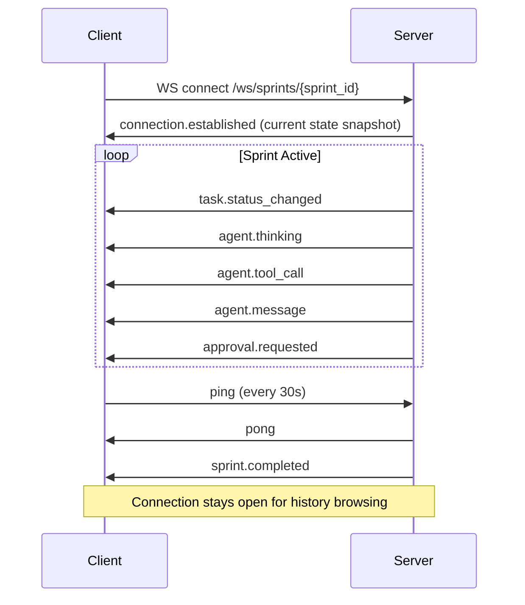
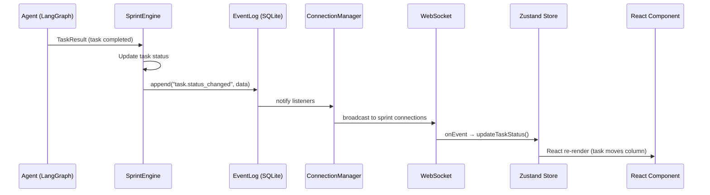
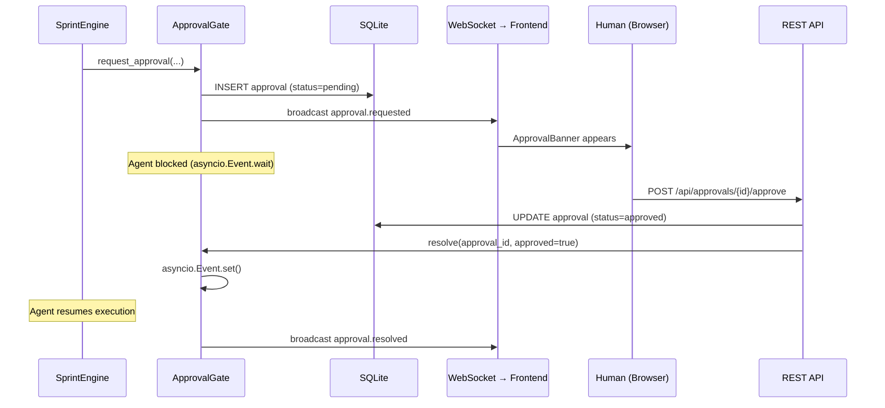

# FoundrAI — Phase 1 Technical Design Document

> **Status:** Draft  
> **Version:** 1.0  
> **Date:** 2026-02-28  
> **Scope:** Visual Layer — Web Dashboard (Weeks 4–7)  
> **Depends on:** Phase 0 (Foundation) — ✅ Complete

---

## Table of Contents

1. [Scope & Goals](#1-scope--goals)
2. [API Design](#2-api-design)
3. [WebSocket Protocol](#3-websocket-protocol)
4. [Frontend Architecture](#4-frontend-architecture)
5. [Sprint Board (SprintBoard.tsx)](#5-sprint-board)
6. [Agent Activity Feed (AgentFeed.tsx)](#6-agent-activity-feed)
7. [Goal Decomposition View (GoalTree.tsx)](#7-goal-decomposition-view)
8. [Human Approval Gates](#8-human-approval-gates)
9. [Server Integration](#9-server-integration)
10. [`foundrai serve` Command](#10-foundrai-serve-command)
11. [Data Flow](#11-data-flow)
12. [Styling & Design System](#12-styling--design-system)
13. [Testing Strategy](#13-testing-strategy)
14. [Build & Deploy](#14-build--deploy)

---

## 1. Scope & Goals

### What Phase 1 Delivers

Phase 1 adds a **live web dashboard** on top of the Phase 0 orchestration engine. Users run `foundrai serve`, open a browser, and watch their AI team work in real-time — with the ability to approve or reject agent decisions.

### Deliverables

| Deliverable | Description |
|---|---|
| FastAPI server | REST endpoints for projects, sprints, tasks, approvals |
| WebSocket server | Real-time event streaming to frontend |
| React frontend | Vite + TypeScript SPA served by FastAPI |
| Sprint Board | Kanban view with live task movement |
| Agent Activity Feed | Scrollable timeline with reasoning traces |
| Goal Decomposition View | Interactive tree via React Flow |
| Human Approval Gates | Approve/reject UI with pending queue |
| `foundrai serve` | CLI command launching uvicorn + browser |

### Definition of Done

A user can run:

```bash
foundrai serve
# Opens http://localhost:8420
foundrai sprint start "Build a todo REST API" --background
```

And observe on the dashboard:
1. Sprint Board showing tasks moving through Kanban columns in real-time
2. Agent Activity Feed streaming agent messages, tool calls, and reasoning
3. Goal Decomposition tree showing how PM broke down the goal
4. Approval gates pausing execution when human decision is required
5. Approve/reject buttons that resume agent workflow

### Exclusions (Not in Phase 1)

- Parallel task execution (Phase 2)
- Sprint retrospectives / vector memory (Phase 2)
- Agent performance analytics / cost tracking dashboard (Phase 3)
- GitHub integration (Phase 4)
- Authentication / multi-user (out of scope — local-first, single user)
- Drag-to-reorder tasks on Kanban (display-only for v1; interactions Phase 2)

---

## 2. API Design

### Base URL

```
http://localhost:8420/api
```

All endpoints return JSON. Errors use RFC 7807 Problem Details format.

### Error Response Schema

```python
class ErrorResponse(BaseModel):
    detail: str
    status_code: int
    error_type: str  # e.g., "not_found", "validation_error"
```

### 2.1 Projects

#### `POST /api/projects`

Create a new project (equivalent to `foundrai init` via API).

```python
class ProjectCreate(BaseModel):
    name: str = Field(..., min_length=1, max_length=100)
    description: str = ""

class ProjectResponse(BaseModel):
    project_id: str
    name: str
    description: str
    created_at: datetime
    sprint_count: int = 0
    current_sprint_id: str | None = None
```

**Status codes:** `201 Created`, `422 Validation Error`

#### `GET /api/projects`

List all projects.

```python
class ProjectListResponse(BaseModel):
    projects: list[ProjectResponse]
    total: int
```

**Status codes:** `200 OK`

#### `GET /api/projects/{project_id}`

Get project details.

**Status codes:** `200 OK`, `404 Not Found`

---

### 2.2 Sprints

#### `POST /api/projects/{project_id}/sprints`

Start a new sprint.

```python
class SprintCreate(BaseModel):
    goal: str = Field(..., min_length=1, max_length=1000)

class SprintResponse(BaseModel):
    sprint_id: str
    project_id: str
    sprint_number: int
    goal: str
    status: SprintStatus  # created | planning | executing | reviewing | completed | failed
    tasks: list[TaskResponse]
    metrics: SprintMetricsResponse
    created_at: datetime
    completed_at: datetime | None = None
    error: str | None = None
```

**Status codes:** `201 Created`, `409 Conflict` (sprint already running), `404 Not Found`

#### `GET /api/projects/{project_id}/sprints`

List sprints for a project.

```python
class SprintListResponse(BaseModel):
    sprints: list[SprintResponse]
    total: int
```

**Query params:** `?status=executing&limit=10&offset=0`

**Status codes:** `200 OK`, `404 Not Found`

#### `GET /api/sprints/{sprint_id}`

Get sprint details with full task list.

**Status codes:** `200 OK`, `404 Not Found`

---

### 2.3 Tasks

#### `GET /api/sprints/{sprint_id}/tasks`

List tasks in a sprint.

```python
class TaskResponse(BaseModel):
    task_id: str
    title: str
    description: str
    acceptance_criteria: list[str]
    assigned_to: str  # AgentRoleName value
    priority: int
    status: TaskStatus  # backlog | in_progress | in_review | done | failed | blocked
    dependencies: list[str]
    result: TaskResultResponse | None = None
    review: ReviewResultResponse | None = None
    created_at: datetime
    updated_at: datetime

class TaskResultResponse(BaseModel):
    agent_id: str
    success: bool
    output: str
    artifacts: list[ArtifactResponse]
    tokens_used: int
    completed_at: datetime

class ReviewResultResponse(BaseModel):
    reviewer_id: str
    passed: bool
    issues: list[str]
    suggestions: list[str]
    reviewed_at: datetime
```

**Query params:** `?status=in_progress&assigned_to=developer`

**Status codes:** `200 OK`, `404 Not Found`

#### `GET /api/tasks/{task_id}`

Get single task detail.

**Status codes:** `200 OK`, `404 Not Found`

---

### 2.4 Events & Messages

#### `GET /api/sprints/{sprint_id}/events`

Get event log for a sprint.

```python
class EventResponse(BaseModel):
    event_id: int
    event_type: str
    data: dict
    timestamp: datetime

class EventListResponse(BaseModel):
    events: list[EventResponse]
    total: int
    has_more: bool
```

**Query params:** `?event_type=agent.message&after_id=100&limit=50`

**Status codes:** `200 OK`, `404 Not Found`

#### `GET /api/sprints/{sprint_id}/messages`

Get agent messages for a sprint.

```python
class MessageResponse(BaseModel):
    message_id: str
    type: str  # MessageType value
    from_agent: str
    to_agent: str | None
    content: str
    metadata: dict
    timestamp: datetime

class MessageListResponse(BaseModel):
    messages: list[MessageResponse]
    total: int
```

**Query params:** `?from_agent=product_manager&type=goal_decomposition`

**Status codes:** `200 OK`, `404 Not Found`

---

### 2.5 Artifacts

#### `GET /api/sprints/{sprint_id}/artifacts`

```python
class ArtifactResponse(BaseModel):
    artifact_id: str
    sprint_id: str
    task_id: str
    agent_id: str
    artifact_type: str
    file_path: str
    size_bytes: int
    created_at: datetime

class ArtifactListResponse(BaseModel):
    artifacts: list[ArtifactResponse]
    total: int
```

**Status codes:** `200 OK`, `404 Not Found`

#### `GET /api/artifacts/{artifact_id}/content`

Download artifact file content.

**Status codes:** `200 OK` (text/plain or application/octet-stream), `404 Not Found`

---

### 2.6 Approvals

#### `GET /api/sprints/{sprint_id}/approvals`

Get pending approval requests.

```python
class ApprovalStatus(str, Enum):
    PENDING = "pending"
    APPROVED = "approved"
    REJECTED = "rejected"
    EXPIRED = "expired"

class ApprovalRequest(BaseModel):
    approval_id: str
    sprint_id: str
    task_id: str | None
    agent_id: str
    action_type: str        # "goal_decomposition", "code_commit", "architecture_decision"
    title: str              # Human-readable summary
    description: str        # Detailed explanation of what the agent wants to do
    context: dict           # Agent reasoning, proposed changes, etc.
    status: ApprovalStatus
    created_at: datetime
    resolved_at: datetime | None = None
    resolved_by: str | None = None  # "human" or auto-resolved

class ApprovalListResponse(BaseModel):
    approvals: list[ApprovalRequest]
    pending_count: int
    total: int
```

**Query params:** `?status=pending`

**Status codes:** `200 OK`, `404 Not Found`

#### `POST /api/approvals/{approval_id}/approve`

```python
class ApprovalDecision(BaseModel):
    comment: str = ""  # Optional human comment/feedback

class ApprovalDecisionResponse(BaseModel):
    approval_id: str
    status: ApprovalStatus
    resolved_at: datetime
```

**Status codes:** `200 OK`, `404 Not Found`, `409 Conflict` (already resolved)

#### `POST /api/approvals/{approval_id}/reject`

Same request/response as approve.

**Status codes:** `200 OK`, `404 Not Found`, `409 Conflict`

---

### 2.7 Sprint Metrics

#### `GET /api/sprints/{sprint_id}/metrics`

```python
class SprintMetricsResponse(BaseModel):
    total_tasks: int
    completed_tasks: int
    failed_tasks: int
    total_tokens: int
    total_llm_calls: int
    duration_seconds: float
    completion_rate: float
    tasks_by_status: dict[str, int]
    tokens_by_agent: dict[str, int]
```

**Status codes:** `200 OK`, `404 Not Found`

---

### 2.8 Goal Decomposition

#### `GET /api/sprints/{sprint_id}/goal-tree`

Returns the goal decomposition as a tree structure for React Flow rendering.

```python
class GoalTreeNode(BaseModel):
    id: str
    type: str           # "goal" | "task"
    label: str
    status: str | None  # TaskStatus value for task nodes
    assigned_to: str | None
    metadata: dict = {}

class GoalTreeEdge(BaseModel):
    source: str
    target: str
    type: str = "default"  # "dependency" | "decomposition"

class GoalTreeResponse(BaseModel):
    nodes: list[GoalTreeNode]
    edges: list[GoalTreeEdge]
```

**Status codes:** `200 OK`, `404 Not Found`

---

## 3. WebSocket Protocol

### Connection

```
ws://localhost:8420/ws/sprints/{sprint_id}
```

Single WebSocket per sprint. The server multiplexes all event types on this connection.

### Message Format

All messages are JSON with a standard envelope:

```typescript
interface WSMessage {
  type: string;           // Event type (dot-separated namespace)
  data: Record<string, any>;  // Event payload
  timestamp: string;      // ISO 8601
  sequence: number;       // Monotonically increasing per connection
}
```

### Event Types

| Event Type | Payload | Description |
|---|---|---|
| `sprint.status_changed` | `{ sprint_id, status, previous_status }` | Sprint phase transition |
| `task.status_changed` | `{ task_id, status, previous_status, assigned_to }` | Task moved columns |
| `task.created` | `{ task: TaskResponse }` | New task added during planning |
| `agent.message` | `{ message: MessageResponse }` | Inter-agent communication |
| `agent.thinking` | `{ agent_id, content, task_id? }` | Agent reasoning trace (streaming) |
| `agent.tool_call` | `{ agent_id, tool_name, input, output?, task_id? }` | Agent invoked a tool |
| `agent.tool_result` | `{ agent_id, tool_name, result, success, task_id? }` | Tool execution result |
| `artifact.created` | `{ artifact: ArtifactResponse }` | New artifact generated |
| `approval.requested` | `{ approval: ApprovalRequest }` | Human decision needed |
| `approval.resolved` | `{ approval_id, status, resolved_by }` | Approval decided |
| `sprint.completed` | `{ sprint_id, metrics: SprintMetricsResponse }` | Sprint finished |
| `sprint.failed` | `{ sprint_id, error }` | Sprint errored out |
| `connection.established` | `{ sprint_id, status, pending_approvals }` | Initial handshake |

### Connection Lifecycle



### Server-Side Implementation

```python
# foundrai/api/websocket.py
from fastapi import WebSocket, WebSocketDisconnect
from typing import Set
import json

class ConnectionManager:
    """Manages WebSocket connections per sprint."""

    def __init__(self) -> None:
        self._connections: dict[str, Set[WebSocket]] = {}  # sprint_id → connections

    async def connect(self, sprint_id: str, websocket: WebSocket) -> None:
        await websocket.accept()
        if sprint_id not in self._connections:
            self._connections[sprint_id] = set()
        self._connections[sprint_id].add(websocket)

    def disconnect(self, sprint_id: str, websocket: WebSocket) -> None:
        self._connections.get(sprint_id, set()).discard(websocket)

    async def broadcast(self, sprint_id: str, message: dict) -> None:
        """Send message to all connections for a sprint."""
        connections = self._connections.get(sprint_id, set())
        dead: list[WebSocket] = []
        for ws in connections:
            try:
                await ws.send_json(message)
            except Exception:
                dead.append(ws)
        for ws in dead:
            connections.discard(ws)

manager = ConnectionManager()
```

### Client-Side Reconnection

```typescript
// frontend/src/hooks/useSprintWebSocket.ts

interface UseSprintWSOptions {
  sprintId: string;
  onEvent: (event: WSMessage) => void;
  enabled?: boolean;
}

function useSprintWebSocket({ sprintId, onEvent, enabled = true }: UseSprintWSOptions) {
  const wsRef = useRef<WebSocket | null>(null);
  const reconnectAttempt = useRef(0);
  const maxReconnectDelay = 30_000;

  useEffect(() => {
    if (!enabled || !sprintId) return;

    function connect() {
      const ws = new WebSocket(`ws://${window.location.host}/ws/sprints/${sprintId}`);

      ws.onopen = () => {
        reconnectAttempt.current = 0;
      };

      ws.onmessage = (event) => {
        const msg: WSMessage = JSON.parse(event.data);
        onEvent(msg);
      };

      ws.onclose = () => {
        // Exponential backoff: 1s, 2s, 4s, 8s, ... 30s max
        const delay = Math.min(1000 * 2 ** reconnectAttempt.current, maxReconnectDelay);
        reconnectAttempt.current++;
        setTimeout(connect, delay);
      };

      wsRef.current = ws;
    }

    connect();
    return () => wsRef.current?.close();
  }, [sprintId, enabled]);
}
```

---

## 4. Frontend Architecture

### Tech Choices

| Concern | Choice | Rationale |
|---|---|---|
| Framework | React 18 | Industry standard, huge ecosystem |
| Language | TypeScript (strict) | Type safety, IDE support |
| Build | Vite 5 | Fast HMR, optimized builds |
| State | Zustand | Minimal boilerplate, good TS support, no providers needed |
| Routing | React Router v6 | Standard, supports nested layouts |
| Graph | React Flow | Purpose-built for node graphs |
| Styling | Tailwind CSS 3 | Utility-first, fast iteration |
| Icons | Lucide React | Clean, consistent, tree-shakeable |
| HTTP | ky (or fetch) | Lightweight, promise-based |

### Folder Structure

```
frontend/
├── index.html
├── vite.config.ts
├── tsconfig.json
├── tailwind.config.ts
├── package.json
├── public/
│   └── favicon.svg
└── src/
    ├── main.tsx                     # Entry point, router setup
    ├── App.tsx                      # Root layout
    ├── api/
    │   ├── client.ts                # HTTP client (base URL, error handling)
    │   ├── projects.ts              # Project API calls
    │   ├── sprints.ts               # Sprint API calls
    │   ├── tasks.ts                 # Task API calls
    │   └── approvals.ts             # Approval API calls
    ├── hooks/
    │   ├── useSprintWebSocket.ts    # WebSocket connection + reconnect
    │   ├── useSprintData.ts         # Combined REST + WS data for a sprint
    │   └── useAutoScroll.ts         # Auto-scroll to bottom of feed
    ├── stores/
    │   ├── sprintStore.ts           # Zustand: current sprint state
    │   ├── eventStore.ts            # Zustand: event feed buffer
    │   └── approvalStore.ts         # Zustand: pending approvals
    ├── components/
    │   ├── layout/
    │   │   ├── Sidebar.tsx          # Project nav, sprint list
    │   │   ├── Header.tsx           # Breadcrumb, sprint status badge
    │   │   └── Layout.tsx           # Grid layout wrapper
    │   ├── sprint/
    │   │   ├── SprintBoard.tsx      # Kanban board
    │   │   ├── KanbanColumn.tsx     # Single column
    │   │   └── TaskCard.tsx         # Task card in column
    │   ├── feed/
    │   │   ├── AgentFeed.tsx        # Activity timeline
    │   │   ├── FeedEntry.tsx        # Single feed item
    │   │   └── FeedFilters.tsx      # Filter controls
    │   ├── tree/
    │   │   ├── GoalTree.tsx         # React Flow wrapper
    │   │   ├── GoalNode.tsx         # Goal root node
    │   │   └── TaskNode.tsx         # Task leaf node
    │   ├── approvals/
    │   │   ├── ApprovalBanner.tsx   # Top banner for pending approvals
    │   │   ├── ApprovalCard.tsx     # Single approval with approve/reject
    │   │   └── ApprovalQueue.tsx    # Full approval list panel
    │   └── shared/
    │       ├── AgentAvatar.tsx      # Colored avatar per agent role
    │       ├── StatusBadge.tsx      # Pill badge for status enums
    │       └── TimeAgo.tsx          # Relative timestamp
    ├── pages/
    │   ├── DashboardPage.tsx        # Project list / home
    │   ├── SprintPage.tsx           # Sprint detail (board + feed + tree)
    │   └── NotFoundPage.tsx
    ├── types/
    │   └── index.ts                 # All TypeScript interfaces
    └── utils/
        ├── cn.ts                    # clsx + tailwind-merge
        └── formatters.ts            # Date, token count formatters
```

### Routing

```typescript
// src/main.tsx
const router = createBrowserRouter([
  {
    path: "/",
    element: <Layout />,
    children: [
      { index: true, element: <DashboardPage /> },
      { path: "sprints/:sprintId", element: <SprintPage /> },
    ],
  },
  { path: "*", element: <NotFoundPage /> },
]);
```

### Component Tree

```
<App>
  <Layout>
    <Header />                    ← sprint status, approval count badge
    <Sidebar />                   ← project list, sprint list
    <main>
      <SprintPage>                ← /sprints/:sprintId
        <ApprovalBanner />        ← shown when pending approvals exist
        <TabBar />                ← Board | Feed | Tree
        <SprintBoard />           ← tab: board (default)
        <AgentFeed />             ← tab: feed
        <GoalTree />              ← tab: tree
      </SprintPage>
    </main>
  </Layout>
</App>
```

### State Management (Zustand)

```typescript
// src/stores/sprintStore.ts
import { create } from 'zustand';

interface SprintStore {
  sprint: SprintResponse | null;
  tasks: TaskResponse[];
  loading: boolean;

  // Actions
  setSprint: (sprint: SprintResponse) => void;
  updateTaskStatus: (taskId: string, status: TaskStatus) => void;
  addTask: (task: TaskResponse) => void;
  setTasks: (tasks: TaskResponse[]) => void;
}

export const useSprintStore = create<SprintStore>((set) => ({
  sprint: null,
  tasks: [],
  loading: true,

  setSprint: (sprint) => set({ sprint, tasks: sprint.tasks, loading: false }),

  updateTaskStatus: (taskId, status) =>
    set((state) => ({
      tasks: state.tasks.map((t) =>
        t.task_id === taskId ? { ...t, status } : t
      ),
    })),

  addTask: (task) =>
    set((state) => ({ tasks: [...state.tasks, task] })),

  setTasks: (tasks) => set({ tasks }),
}));
```

```typescript
// src/stores/eventStore.ts
import { create } from 'zustand';

interface EventStore {
  events: WSMessage[];
  filters: { agentId?: string; eventType?: string };

  addEvent: (event: WSMessage) => void;
  setFilters: (filters: Partial<EventStore['filters']>) => void;
  clearEvents: () => void;

  // Derived
  filteredEvents: () => WSMessage[];
}

export const useEventStore = create<EventStore>((set, get) => ({
  events: [],
  filters: {},

  addEvent: (event) =>
    set((state) => ({
      events: [...state.events, event].slice(-500), // Keep last 500
    })),

  setFilters: (filters) =>
    set((state) => ({ filters: { ...state.filters, ...filters } })),

  clearEvents: () => set({ events: [] }),

  filteredEvents: () => {
    const { events, filters } = get();
    return events.filter((e) => {
      if (filters.agentId && e.data.agent_id !== filters.agentId) return false;
      if (filters.eventType && e.type !== filters.eventType) return false;
      return true;
    });
  },
}));
```

```typescript
// src/stores/approvalStore.ts
import { create } from 'zustand';

interface ApprovalStore {
  approvals: ApprovalRequest[];
  pendingCount: number;

  setApprovals: (approvals: ApprovalRequest[]) => void;
  addApproval: (approval: ApprovalRequest) => void;
  resolveApproval: (approvalId: string, status: ApprovalStatus) => void;
}

export const useApprovalStore = create<ApprovalStore>((set) => ({
  approvals: [],
  pendingCount: 0,

  setApprovals: (approvals) =>
    set({
      approvals,
      pendingCount: approvals.filter((a) => a.status === 'pending').length,
    }),

  addApproval: (approval) =>
    set((state) => ({
      approvals: [approval, ...state.approvals],
      pendingCount: state.pendingCount + 1,
    })),

  resolveApproval: (approvalId, status) =>
    set((state) => ({
      approvals: state.approvals.map((a) =>
        a.approval_id === approvalId ? { ...a, status } : a
      ),
      pendingCount: Math.max(0, state.pendingCount - 1),
    })),
}));
```

### TypeScript Interfaces

```typescript
// src/types/index.ts

// === Enums ===

type SprintStatus = 'created' | 'planning' | 'executing' | 'reviewing' | 'completed' | 'failed' | 'cancelled';
type TaskStatus = 'backlog' | 'in_progress' | 'in_review' | 'done' | 'failed' | 'blocked';
type ApprovalStatus = 'pending' | 'approved' | 'rejected' | 'expired';
type AgentRole = 'product_manager' | 'developer' | 'qa_engineer' | 'architect' | 'designer' | 'devops';

// === API Responses ===

interface ProjectResponse {
  project_id: string;
  name: string;
  description: string;
  created_at: string;
  sprint_count: number;
  current_sprint_id: string | null;
}

interface SprintResponse {
  sprint_id: string;
  project_id: string;
  sprint_number: number;
  goal: string;
  status: SprintStatus;
  tasks: TaskResponse[];
  metrics: SprintMetricsResponse;
  created_at: string;
  completed_at: string | null;
  error: string | null;
}

interface TaskResponse {
  task_id: string;
  title: string;
  description: string;
  acceptance_criteria: string[];
  assigned_to: AgentRole;
  priority: number;
  status: TaskStatus;
  dependencies: string[];
  result: TaskResultResponse | null;
  review: ReviewResultResponse | null;
  created_at: string;
  updated_at: string;
}

interface TaskResultResponse {
  agent_id: string;
  success: boolean;
  output: string;
  artifacts: ArtifactResponse[];
  tokens_used: number;
  completed_at: string;
}

interface ReviewResultResponse {
  reviewer_id: string;
  passed: boolean;
  issues: string[];
  suggestions: string[];
  reviewed_at: string;
}

interface ArtifactResponse {
  artifact_id: string;
  sprint_id: string;
  task_id: string;
  agent_id: string;
  artifact_type: string;
  file_path: string;
  size_bytes: number;
  created_at: string;
}

interface SprintMetricsResponse {
  total_tasks: number;
  completed_tasks: number;
  failed_tasks: number;
  total_tokens: number;
  total_llm_calls: number;
  duration_seconds: number;
  completion_rate: number;
  tasks_by_status: Record<string, number>;
  tokens_by_agent: Record<string, number>;
}

interface ApprovalRequest {
  approval_id: string;
  sprint_id: string;
  task_id: string | null;
  agent_id: string;
  action_type: string;
  title: string;
  description: string;
  context: Record<string, any>;
  status: ApprovalStatus;
  created_at: string;
  resolved_at: string | null;
}

// === WebSocket ===

interface WSMessage {
  type: string;
  data: Record<string, any>;
  timestamp: string;
  sequence: number;
}

// === Goal Tree ===

interface GoalTreeNode {
  id: string;
  type: 'goal' | 'task';
  label: string;
  status: TaskStatus | null;
  assigned_to: AgentRole | null;
  metadata: Record<string, any>;
}

interface GoalTreeEdge {
  source: string;
  target: string;
  type: 'dependency' | 'decomposition';
}
```

---

## 5. Sprint Board

### SprintBoard.tsx

The Kanban board groups tasks into columns by status. Columns update in real-time via WebSocket events.

### Columns

| Column | TaskStatus values | Color |
|---|---|---|
| Backlog | `backlog`, `blocked` | Gray |
| In Progress | `in_progress` | Blue |
| In Review | `in_review` | Yellow |
| Done | `done` | Green |
| Failed | `failed` | Red |

### Component Design

```typescript
// src/components/sprint/SprintBoard.tsx

const COLUMNS: { key: string; title: string; statuses: TaskStatus[]; color: string }[] = [
  { key: 'backlog',     title: 'Backlog',     statuses: ['backlog', 'blocked'], color: 'gray' },
  { key: 'in_progress', title: 'In Progress', statuses: ['in_progress'],        color: 'blue' },
  { key: 'in_review',   title: 'In Review',   statuses: ['in_review'],          color: 'yellow' },
  { key: 'done',        title: 'Done',        statuses: ['done'],               color: 'green' },
  { key: 'failed',      title: 'Failed',      statuses: ['failed'],             color: 'red' },
];

export function SprintBoard() {
  const tasks = useSprintStore((s) => s.tasks);

  return (
    <div className="flex gap-4 overflow-x-auto p-4 h-full">
      {COLUMNS.map((col) => (
        <KanbanColumn
          key={col.key}
          title={col.title}
          color={col.color}
          tasks={tasks.filter((t) => col.statuses.includes(t.status))}
          count={tasks.filter((t) => col.statuses.includes(t.status)).length}
        />
      ))}
    </div>
  );
}
```

### TaskCard Design

```typescript
// src/components/sprint/TaskCard.tsx

export function TaskCard({ task }: { task: TaskResponse }) {
  const [expanded, setExpanded] = useState(false);

  return (
    <div
      className={cn(
        "bg-white dark:bg-gray-800 rounded-lg border p-3 shadow-sm",
        "hover:shadow-md transition-shadow cursor-pointer",
        task.status === 'failed' && "border-red-300"
      )}
      onClick={() => setExpanded(!expanded)}
    >
      {/* Header */}
      <div className="flex items-start justify-between gap-2">
        <h4 className="text-sm font-medium leading-tight">{task.title}</h4>
        <StatusBadge status={task.status} />
      </div>

      {/* Agent assignment */}
      <div className="flex items-center gap-1.5 mt-2">
        <AgentAvatar role={task.assigned_to} size="sm" />
        <span className="text-xs text-gray-500 capitalize">
          {task.assigned_to.replace('_', ' ')}
        </span>
      </div>

      {/* Priority indicator */}
      <div className="flex items-center gap-1 mt-2">
        {Array.from({ length: 5 - task.priority + 1 }, (_, i) => (
          <div key={i} className="w-1.5 h-1.5 rounded-full bg-orange-400" />
        ))}
      </div>

      {/* Expanded detail */}
      {expanded && (
        <div className="mt-3 pt-3 border-t text-xs text-gray-600 space-y-2">
          <p>{task.description}</p>
          {task.acceptance_criteria.length > 0 && (
            <ul className="list-disc list-inside space-y-0.5">
              {task.acceptance_criteria.map((ac, i) => (
                <li key={i}>{ac}</li>
              ))}
            </ul>
          )}
          {task.result && (
            <div className="bg-gray-50 dark:bg-gray-900 rounded p-2 mt-2">
              <span className="font-medium">Result:</span>
              <pre className="whitespace-pre-wrap mt-1">{task.result.output}</pre>
            </div>
          )}
        </div>
      )}
    </div>
  );
}
```

### Real-Time Updates

When a `task.status_changed` WebSocket event arrives, the Zustand store updates and React re-renders the card in the correct column. A CSS transition animates the card between columns:

```css
/* Task card enters a new column with a subtle slide-in */
.task-card-enter {
  animation: slideIn 300ms ease-out;
}

@keyframes slideIn {
  from { opacity: 0; transform: translateY(-8px); }
  to   { opacity: 1; transform: translateY(0); }
}
```

---

## 6. Agent Activity Feed

### AgentFeed.tsx

A reverse-chronological timeline of all agent events. Color-coded by agent role. Filterable. Auto-scrolls to latest.

### Feed Entry Types

| Event Type | Display | Icon |
|---|---|---|
| `agent.message` | Quoted message with from/to | 💬 |
| `agent.thinking` | Collapsible reasoning trace | 🧠 |
| `agent.tool_call` | Tool name + input summary | 🔧 |
| `agent.tool_result` | Success/failure + output snippet | ✅❌ |
| `task.status_changed` | "Task X moved to In Progress" | 📋 |
| `task.created` | "New task: X" | ➕ |
| `sprint.status_changed` | "Sprint moved to Executing" | 🏃 |
| `approval.requested` | Highlighted with action buttons | ⚠️ |
| `artifact.created` | File path + size | 📄 |

### Component Design

```typescript
// src/components/feed/AgentFeed.tsx

export function AgentFeed() {
  const events = useEventStore((s) => s.events);
  const filters = useEventStore((s) => s.filters);
  const filteredEvents = useEventStore((s) => s.filteredEvents());
  const bottomRef = useRef<HTMLDivElement>(null);
  const [autoScroll, setAutoScroll] = useState(true);

  // Auto-scroll to bottom on new events
  useEffect(() => {
    if (autoScroll) {
      bottomRef.current?.scrollIntoView({ behavior: 'smooth' });
    }
  }, [filteredEvents.length, autoScroll]);

  // Detect manual scroll-up to pause auto-scroll
  const handleScroll = (e: React.UIEvent<HTMLDivElement>) => {
    const el = e.currentTarget;
    const atBottom = el.scrollHeight - el.scrollTop - el.clientHeight < 50;
    setAutoScroll(atBottom);
  };

  return (
    <div className="flex flex-col h-full">
      <FeedFilters />
      <div
        className="flex-1 overflow-y-auto p-4 space-y-2"
        onScroll={handleScroll}
      >
        {filteredEvents.map((event) => (
          <FeedEntry key={event.sequence} event={event} />
        ))}
        <div ref={bottomRef} />
      </div>
      {!autoScroll && (
        <button
          onClick={() => {
            setAutoScroll(true);
            bottomRef.current?.scrollIntoView({ behavior: 'smooth' });
          }}
          className="absolute bottom-4 right-4 bg-blue-600 text-white rounded-full p-2 shadow-lg"
        >
          ↓ New activity
        </button>
      )}
    </div>
  );
}
```

### FeedEntry Design

```typescript
// src/components/feed/FeedEntry.tsx

const EVENT_CONFIG: Record<string, { icon: string; label: string }> = {
  'agent.message':    { icon: '💬', label: 'Message' },
  'agent.thinking':   { icon: '🧠', label: 'Thinking' },
  'agent.tool_call':  { icon: '🔧', label: 'Tool Call' },
  'agent.tool_result':{ icon: '✅', label: 'Tool Result' },
  'task.status_changed': { icon: '📋', label: 'Task Update' },
  'task.created':     { icon: '➕', label: 'New Task' },
  'approval.requested': { icon: '⚠️', label: 'Approval Needed' },
  'artifact.created': { icon: '📄', label: 'Artifact' },
};

export function FeedEntry({ event }: { event: WSMessage }) {
  const [expanded, setExpanded] = useState(false);
  const config = EVENT_CONFIG[event.type] ?? { icon: '📌', label: event.type };
  const agentId = event.data.agent_id ?? event.data.from_agent;

  return (
    <div className="flex gap-3 text-sm">
      {/* Timeline dot */}
      <div className="flex flex-col items-center">
        <AgentAvatar role={agentId} size="xs" />
        <div className="w-px flex-1 bg-gray-200 dark:bg-gray-700" />
      </div>

      {/* Content */}
      <div className="flex-1 pb-4">
        <div className="flex items-center gap-2">
          <span>{config.icon}</span>
          <span className="font-medium capitalize">{agentId?.replace('_', ' ')}</span>
          <span className="text-gray-400">·</span>
          <TimeAgo timestamp={event.timestamp} />
        </div>

        <div className="mt-1 text-gray-700 dark:text-gray-300">
          {renderEventContent(event)}
        </div>

        {/* Expandable detail for thinking/tool_call */}
        {(event.type === 'agent.thinking' || event.type === 'agent.tool_call') && (
          <button
            onClick={() => setExpanded(!expanded)}
            className="text-xs text-blue-500 mt-1 hover:underline"
          >
            {expanded ? 'Collapse' : 'Show details'}
          </button>
        )}
        {expanded && (
          <pre className="mt-2 bg-gray-50 dark:bg-gray-900 rounded p-2 text-xs overflow-x-auto whitespace-pre-wrap">
            {JSON.stringify(event.data, null, 2)}
          </pre>
        )}
      </div>
    </div>
  );
}
```

### Filtering

```typescript
// src/components/feed/FeedFilters.tsx

export function FeedFilters() {
  const { filters, setFilters } = useEventStore();

  return (
    <div className="flex gap-2 p-3 border-b">
      <select
        value={filters.agentId ?? ''}
        onChange={(e) => setFilters({ agentId: e.target.value || undefined })}
        className="text-sm border rounded px-2 py-1"
      >
        <option value="">All Agents</option>
        <option value="product_manager">Product Manager</option>
        <option value="developer">Developer</option>
        <option value="qa_engineer">QA Engineer</option>
      </select>

      <select
        value={filters.eventType ?? ''}
        onChange={(e) => setFilters({ eventType: e.target.value || undefined })}
        className="text-sm border rounded px-2 py-1"
      >
        <option value="">All Events</option>
        <option value="agent.message">Messages</option>
        <option value="agent.thinking">Thinking</option>
        <option value="agent.tool_call">Tool Calls</option>
        <option value="task.status_changed">Task Updates</option>
        <option value="approval.requested">Approvals</option>
      </select>
    </div>
  );
}
```

---

## 7. Goal Decomposition View

### GoalTree.tsx

Interactive tree built with React Flow showing `Goal → Tasks` with dependency edges. Nodes are colored by status, edges show decomposition (goal→task) and dependency (task→task) relationships.

### Node Types

```typescript
// src/components/tree/GoalNode.tsx
import { Handle, Position, type NodeProps } from 'reactflow';

interface GoalNodeData {
  label: string;
  status: SprintStatus;
}

export function GoalNode({ data }: NodeProps<GoalNodeData>) {
  return (
    <div className="bg-purple-600 text-white rounded-xl px-6 py-3 shadow-lg min-w-[200px]">
      <div className="text-xs uppercase tracking-wide opacity-75">Goal</div>
      <div className="font-semibold mt-1">{data.label}</div>
      <StatusBadge status={data.status} variant="light" className="mt-2" />
      <Handle type="source" position={Position.Bottom} className="!bg-purple-400" />
    </div>
  );
}
```

```typescript
// src/components/tree/TaskNode.tsx
import { Handle, Position, type NodeProps } from 'reactflow';

interface TaskNodeData {
  label: string;
  status: TaskStatus;
  assigned_to: AgentRole;
}

const STATUS_COLORS: Record<TaskStatus, string> = {
  backlog: 'border-gray-300 bg-gray-50',
  in_progress: 'border-blue-400 bg-blue-50',
  in_review: 'border-yellow-400 bg-yellow-50',
  done: 'border-green-400 bg-green-50',
  failed: 'border-red-400 bg-red-50',
  blocked: 'border-gray-400 bg-gray-100',
};

export function TaskNode({ data }: NodeProps<TaskNodeData>) {
  return (
    <div className={cn(
      "border-2 rounded-lg px-4 py-2 shadow-sm min-w-[180px]",
      STATUS_COLORS[data.status]
    )}>
      <Handle type="target" position={Position.Top} />
      <div className="flex items-center gap-2">
        <AgentAvatar role={data.assigned_to} size="xs" />
        <span className="text-sm font-medium">{data.label}</span>
      </div>
      <StatusBadge status={data.status} size="sm" className="mt-1" />
      <Handle type="source" position={Position.Bottom} />
    </div>
  );
}
```

### Edge Types

| Edge Type | Style | Meaning |
|---|---|---|
| `decomposition` | Solid, gray, animated | Goal decomposed into this task |
| `dependency` | Dashed, blue, arrow | Task depends on another task |

### Layout Algorithm

Use `dagre` (via `@dagrejs/dagre`) for automatic top-down tree layout:

```typescript
// src/components/tree/GoalTree.tsx
import ReactFlow, {
  Background,
  Controls,
  MiniMap,
  useNodesState,
  useEdgesState,
  type Node,
  type Edge,
} from 'reactflow';
import dagre from '@dagrejs/dagre';

const nodeTypes = { goal: GoalNode, task: TaskNode };

function layoutTree(nodes: Node[], edges: Edge[]): { nodes: Node[]; edges: Edge[] } {
  const g = new dagre.graphlib.Graph();
  g.setDefaultEdgeLabel(() => ({}));
  g.setGraph({ rankdir: 'TB', nodesep: 60, ranksep: 80 });

  nodes.forEach((node) => {
    g.setNode(node.id, { width: 200, height: 80 });
  });
  edges.forEach((edge) => {
    g.setEdge(edge.source, edge.target);
  });

  dagre.layout(g);

  const layoutedNodes = nodes.map((node) => {
    const pos = g.node(node.id);
    return { ...node, position: { x: pos.x - 100, y: pos.y - 40 } };
  });

  return { nodes: layoutedNodes, edges };
}

export function GoalTree({ sprintId }: { sprintId: string }) {
  const [nodes, setNodes, onNodesChange] = useNodesState([]);
  const [edges, setEdges, onEdgesChange] = useEdgesState([]);

  useEffect(() => {
    fetch(`/api/sprints/${sprintId}/goal-tree`)
      .then((r) => r.json())
      .then((data: GoalTreeResponse) => {
        const rfNodes: Node[] = data.nodes.map((n) => ({
          id: n.id,
          type: n.type,
          data: { label: n.label, status: n.status, assigned_to: n.assigned_to },
          position: { x: 0, y: 0 },
        }));
        const rfEdges: Edge[] = data.edges.map((e) => ({
          id: `${e.source}-${e.target}`,
          source: e.source,
          target: e.target,
          type: 'smoothstep',
          animated: e.type === 'decomposition',
          style: e.type === 'dependency'
            ? { strokeDasharray: '5 5', stroke: '#3b82f6' }
            : { stroke: '#9ca3af' },
        }));
        const laid = layoutTree(rfNodes, rfEdges);
        setNodes(laid.nodes);
        setEdges(laid.edges);
      });
  }, [sprintId]);

  return (
    <div className="h-full w-full">
      <ReactFlow
        nodes={nodes}
        edges={edges}
        nodeTypes={nodeTypes}
        onNodesChange={onNodesChange}
        onEdgesChange={onEdgesChange}
        fitView
        proOptions={{ hideAttribution: true }}
      >
        <Background />
        <Controls />
        <MiniMap />
      </ReactFlow>
    </div>
  );
}
```

### Real-Time Node Updates

When `task.status_changed` arrives via WebSocket, update the node's data:

```typescript
// Inside SprintPage WS handler:
case 'task.status_changed':
  // Update tree node color
  setNodes((nds) =>
    nds.map((n) =>
      n.id === event.data.task_id
        ? { ...n, data: { ...n.data, status: event.data.status } }
        : n
    )
  );
  break;
```

---

## 8. Human Approval Gates

### Backend: Approval System

Integrates with Phase 0's `AutonomyLevel` and the existing `HumanGateway` concept from ARCHITECTURE.md.

```python
# foundrai/orchestration/approval_gate.py

class ApprovalGate:
    """Manages human approval requests.

    When an agent action requires approval (based on autonomy config),
    the gate creates an ApprovalRequest, pauses the agent, and waits
    for human resolution via the API.
    """

    def __init__(self, db: Database, ws_manager: ConnectionManager) -> None:
        self.db = db
        self.ws_manager = ws_manager
        self._pending: dict[str, asyncio.Event] = {}  # approval_id → resolved event

    async def request_approval(
        self,
        sprint_id: str,
        agent_id: str,
        action_type: str,
        title: str,
        description: str,
        context: dict,
        task_id: str | None = None,
    ) -> ApprovalResult:
        """Create an approval request and block until resolved.

        Returns the human's decision (approved/rejected + comment).
        """
        approval_id = generate_id()
        approval = ApprovalRequest(
            approval_id=approval_id,
            sprint_id=sprint_id,
            task_id=task_id,
            agent_id=agent_id,
            action_type=action_type,
            title=title,
            description=description,
            context=context,
            status=ApprovalStatus.PENDING,
            created_at=datetime.utcnow(),
        )

        # Persist
        await self._save_approval(approval)

        # Notify via WebSocket
        await self.ws_manager.broadcast(sprint_id, {
            "type": "approval.requested",
            "data": approval.model_dump(mode="json"),
            "timestamp": datetime.utcnow().isoformat(),
            "sequence": -1,
        })

        # Block until resolved
        event = asyncio.Event()
        self._pending[approval_id] = event
        await event.wait()
        del self._pending[approval_id]

        # Read result
        return await self._get_approval_result(approval_id)

    async def resolve(self, approval_id: str, approved: bool, comment: str = "") -> None:
        """Called by the API when human approves/rejects."""
        status = ApprovalStatus.APPROVED if approved else ApprovalStatus.REJECTED
        await self._update_approval(approval_id, status, comment)

        # Unblock the waiting agent
        if approval_id in self._pending:
            self._pending[approval_id].set()
```

### Database Table

```sql
CREATE TABLE IF NOT EXISTS approvals (
    approval_id TEXT PRIMARY KEY,
    sprint_id TEXT NOT NULL,
    task_id TEXT,
    agent_id TEXT NOT NULL,
    action_type TEXT NOT NULL,
    title TEXT NOT NULL,
    description TEXT NOT NULL DEFAULT '',
    context_json TEXT DEFAULT '{}',
    status TEXT NOT NULL DEFAULT 'pending',
    comment TEXT DEFAULT '',
    created_at TEXT NOT NULL DEFAULT (datetime('now')),
    resolved_at TEXT
);
CREATE INDEX idx_approvals_sprint ON approvals(sprint_id);
CREATE INDEX idx_approvals_status ON approvals(status);
```

### Integration with SprintEngine

The engine checks autonomy level before executing agent actions:

```python
# In SprintEngine._execute_node (modified from Phase 0):

async def _execute_node(self, state: SprintState) -> SprintState:
    dev = self.agents[AgentRoleName.DEVELOPER]
    execution_order = self.task_graph.get_execution_order()

    for task in execution_order:
        if task.assigned_to != AgentRoleName.DEVELOPER:
            continue

        # Check if approval needed
        role = self.agents[task.assigned_to].role
        if role.autonomy_level == AutonomyLevel.REQUIRE_APPROVAL:
            result = await self.approval_gate.request_approval(
                sprint_id=state["sprint_id"],
                agent_id=task.assigned_to,
                action_type="task_execution",
                title=f"Execute: {task.title}",
                description=f"Agent wants to work on: {task.description}",
                context={"acceptance_criteria": task.acceptance_criteria},
                task_id=task.id,
            )
            if not result.approved:
                task.status = TaskStatus.BLOCKED
                continue

        task.status = TaskStatus.IN_PROGRESS
        await self._emit_task_status(task)
        result = await dev.execute_task(task)
        # ... rest as before
```

### Frontend: Approval UI

#### ApprovalBanner

Sticky banner at the top of SprintPage when pending approvals exist:

```typescript
// src/components/approvals/ApprovalBanner.tsx

export function ApprovalBanner() {
  const pendingCount = useApprovalStore((s) => s.pendingCount);

  if (pendingCount === 0) return null;

  return (
    <div className="bg-amber-50 border-b border-amber-200 px-4 py-2 flex items-center justify-between">
      <div className="flex items-center gap-2">
        <span className="text-amber-600 text-lg">⚠️</span>
        <span className="text-sm font-medium text-amber-800">
          {pendingCount} approval{pendingCount > 1 ? 's' : ''} waiting for your decision
        </span>
      </div>
      <button className="text-sm text-amber-700 hover:underline font-medium">
        Review →
      </button>
    </div>
  );
}
```

#### ApprovalCard

Individual approval with context and action buttons:

```typescript
// src/components/approvals/ApprovalCard.tsx

export function ApprovalCard({ approval }: { approval: ApprovalRequest }) {
  const resolveApproval = useApprovalStore((s) => s.resolveApproval);
  const [comment, setComment] = useState('');
  const [loading, setLoading] = useState(false);

  const handleDecision = async (approved: boolean) => {
    setLoading(true);
    const endpoint = approved ? 'approve' : 'reject';
    await fetch(`/api/approvals/${approval.approval_id}/${endpoint}`, {
      method: 'POST',
      headers: { 'Content-Type': 'application/json' },
      body: JSON.stringify({ comment }),
    });
    resolveApproval(approval.approval_id, approved ? 'approved' : 'rejected');
    setLoading(false);
  };

  return (
    <div className="border-2 border-amber-300 rounded-lg p-4 bg-amber-50/50">
      <div className="flex items-start gap-3">
        <AgentAvatar role={approval.agent_id as AgentRole} />
        <div className="flex-1">
          <h3 className="font-semibold">{approval.title}</h3>
          <p className="text-sm text-gray-600 mt-1">{approval.description}</p>

          {/* Context detail */}
          {Object.keys(approval.context).length > 0 && (
            <details className="mt-2">
              <summary className="text-xs text-gray-500 cursor-pointer">View context</summary>
              <pre className="mt-1 text-xs bg-white rounded p-2 overflow-x-auto">
                {JSON.stringify(approval.context, null, 2)}
              </pre>
            </details>
          )}

          {/* Comment */}
          <textarea
            value={comment}
            onChange={(e) => setComment(e.target.value)}
            placeholder="Optional feedback for the agent..."
            className="w-full mt-3 text-sm border rounded p-2 h-16 resize-none"
          />

          {/* Actions */}
          <div className="flex gap-2 mt-3">
            <button
              onClick={() => handleDecision(true)}
              disabled={loading}
              className="px-4 py-1.5 bg-green-600 text-white rounded text-sm font-medium hover:bg-green-700 disabled:opacity-50"
            >
              ✓ Approve
            </button>
            <button
              onClick={() => handleDecision(false)}
              disabled={loading}
              className="px-4 py-1.5 bg-red-600 text-white rounded text-sm font-medium hover:bg-red-700 disabled:opacity-50"
            >
              ✗ Reject
            </button>
          </div>
        </div>
      </div>
    </div>
  );
}
```

---

## 9. Server Integration

### FastAPI App Structure

```python
# foundrai/api/app.py
from fastapi import FastAPI
from fastapi.staticfiles import StaticFiles
from fastapi.middleware.cors import CORSMiddleware
from pathlib import Path

def create_app(config: "FoundrAIConfig") -> FastAPI:
    app = FastAPI(
        title="FoundrAI",
        version="0.1.0",
        docs_url="/api/docs",
        redoc_url="/api/redoc",
    )

    # CORS for dev mode (Vite on :5173)
    app.add_middleware(
        CORSMiddleware,
        allow_origins=config.server.cors_origins,
        allow_credentials=True,
        allow_methods=["*"],
        allow_headers=["*"],
    )

    # API routes
    from foundrai.api.routes import projects, sprints, tasks, approvals, events
    app.include_router(projects.router, prefix="/api")
    app.include_router(sprints.router, prefix="/api")
    app.include_router(tasks.router, prefix="/api")
    app.include_router(approvals.router, prefix="/api")
    app.include_router(events.router, prefix="/api")

    # WebSocket
    from foundrai.api.websocket import ws_router
    app.include_router(ws_router)

    # Static frontend (production: built Vite output)
    frontend_dir = Path(__file__).parent.parent / "frontend" / "dist"
    if frontend_dir.exists():
        app.mount("/", StaticFiles(directory=str(frontend_dir), html=True), name="frontend")

    return app
```

### File Structure (API module)

```
foundrai/api/
├── __init__.py
├── app.py               # FastAPI app factory
├── deps.py              # Dependency injection (DB, stores, etc.)
├── websocket.py         # WebSocket endpoint + ConnectionManager
└── routes/
    ├── __init__.py
    ├── projects.py       # /api/projects
    ├── sprints.py        # /api/projects/{id}/sprints, /api/sprints/{id}
    ├── tasks.py          # /api/sprints/{id}/tasks, /api/tasks/{id}
    ├── approvals.py      # /api/approvals
    └── events.py         # /api/sprints/{id}/events, /api/sprints/{id}/messages
```

### Dependency Injection

```python
# foundrai/api/deps.py
from functools import lru_cache
from foundrai.persistence.database import Database
from foundrai.persistence.sprint_store import SprintStore
from foundrai.persistence.event_log import EventLog

_db: Database | None = None

async def get_db() -> Database:
    global _db
    if _db is None:
        _db = Database(config.persistence.sqlite_path)
        await _db.connect()
    return _db

async def get_sprint_store() -> SprintStore:
    db = await get_db()
    return SprintStore(db)

async def get_event_log() -> EventLog:
    db = await get_db()
    return EventLog(db)
```

### Dev Mode: Vite Proxy

During development, Vite runs on `:5173` and proxies API/WS calls to FastAPI on `:8420`:

```typescript
// frontend/vite.config.ts
import { defineConfig } from 'vite';
import react from '@vitejs/plugin-react';

export default defineConfig({
  plugins: [react()],
  server: {
    port: 5173,
    proxy: {
      '/api': {
        target: 'http://localhost:8420',
        changeOrigin: true,
      },
      '/ws': {
        target: 'ws://localhost:8420',
        ws: true,
      },
    },
  },
});
```

### Production Mode

FastAPI serves the built Vite static files directly. No separate frontend server needed.

---

## 10. `foundrai serve` Command

```python
# foundrai/cli.py (additions)
import typer

@app.command()
def serve(
    port: int = typer.Option(8420, "--port", "-p", help="Server port"),
    host: str = typer.Option("0.0.0.0", "--host", help="Bind address"),
    no_browser: bool = typer.Option(False, "--no-browser", help="Don't open browser"),
    dev: bool = typer.Option(False, "--dev", help="Enable dev mode (CORS, reload)"),
) -> None:
    """Start the FoundrAI web dashboard."""
    import uvicorn
    from foundrai.config import load_config

    config = load_config()
    config.server.port = port
    config.server.host = host

    # Open browser after short delay
    if not no_browser:
        import threading, webbrowser, time
        def open_browser():
            time.sleep(1.5)
            webbrowser.open(f"http://localhost:{port}")
        threading.Thread(target=open_browser, daemon=True).start()

    console.print(f"[bold green]🚀 FoundrAI Dashboard[/] → http://localhost:{port}")

    uvicorn.run(
        "foundrai.api.app:create_app",
        factory=True,
        host=host,
        port=port,
        reload=dev,
        log_level="info",
    )
```

### Sprint Start in Background

To run a sprint while the dashboard is up:

```python
@app.command(name="sprint-start")
def sprint_start(
    goal: str = typer.Argument(..., help="Sprint goal"),
    background: bool = typer.Option(False, "--background", "-b", help="Run in background (requires serve)"),
) -> None:
    """Start a new sprint."""
    if background:
        # POST to the running server
        import httpx
        config = load_config()
        resp = httpx.post(
            f"http://localhost:{config.server.port}/api/projects/default/sprints",
            json={"goal": goal},
        )
        if resp.status_code == 201:
            data = resp.json()
            console.print(f"[green]Sprint started:[/] {data['sprint_id']}")
        else:
            console.print(f"[red]Error:[/] {resp.text}")
    else:
        # Original Phase 0 behavior — run directly
        asyncio.run(_run_sprint(goal))
```

---

## 11. Data Flow

### End-to-End: Agent Action → Frontend Update



### Approval Flow



### Event Flow Integration

The Phase 0 `EventLog` is extended with a WebSocket listener:

```python
# In app startup:
async def on_startup():
    event_log = await get_event_log()
    event_log.register_listener(ws_event_forwarder)

async def ws_event_forwarder(event_type: str, data: dict):
    """Forward EventLog events to WebSocket connections."""
    sprint_id = data.get("sprint_id")
    if sprint_id:
        await manager.broadcast(sprint_id, {
            "type": event_type,
            "data": data,
            "timestamp": datetime.utcnow().isoformat(),
            "sequence": -1,  # Server assigns
        })
```

---

## 12. Styling & Design System

### Tailwind Configuration

```typescript
// tailwind.config.ts
import type { Config } from 'tailwindcss';

export default {
  content: ['./index.html', './src/**/*.{ts,tsx}'],
  darkMode: 'class',
  theme: {
    extend: {
      colors: {
        // Agent role colors
        agent: {
          pm: { DEFAULT: '#8B5CF6', light: '#EDE9FE' },       // Purple
          dev: { DEFAULT: '#3B82F6', light: '#DBEAFE' },       // Blue
          qa: { DEFAULT: '#10B981', light: '#D1FAE5' },        // Green
          architect: { DEFAULT: '#F59E0B', light: '#FEF3C7' }, // Amber
          designer: { DEFAULT: '#EC4899', light: '#FCE7F3' },  // Pink
          devops: { DEFAULT: '#6366F1', light: '#E0E7FF' },    // Indigo
        },
        // Sprint status colors
        status: {
          backlog: '#9CA3AF',
          'in-progress': '#3B82F6',
          'in-review': '#F59E0B',
          done: '#10B981',
          failed: '#EF4444',
          blocked: '#6B7280',
        },
      },
      fontFamily: {
        sans: ['Inter', 'system-ui', 'sans-serif'],
        mono: ['JetBrains Mono', 'Fira Code', 'monospace'],
      },
    },
  },
  plugins: [],
} satisfies Config;
```

### Agent Avatar Color Map

```typescript
// src/components/shared/AgentAvatar.tsx

const AGENT_COLORS: Record<AgentRole, { bg: string; text: string; emoji: string }> = {
  product_manager: { bg: 'bg-agent-pm',       text: 'text-white', emoji: '📋' },
  developer:       { bg: 'bg-agent-dev',      text: 'text-white', emoji: '💻' },
  qa_engineer:     { bg: 'bg-agent-qa',       text: 'text-white', emoji: '🧪' },
  architect:       { bg: 'bg-agent-architect', text: 'text-white', emoji: '🏗️' },
  designer:        { bg: 'bg-agent-designer',  text: 'text-white', emoji: '🎨' },
  devops:          { bg: 'bg-agent-devops',    text: 'text-white', emoji: '🚀' },
};

export function AgentAvatar({ role, size = 'md' }: { role: AgentRole; size?: 'xs' | 'sm' | 'md' }) {
  const config = AGENT_COLORS[role] ?? AGENT_COLORS.developer;
  const sizes = { xs: 'w-5 h-5 text-xs', sm: 'w-6 h-6 text-xs', md: 'w-8 h-8 text-sm' };

  return (
    <div className={cn(
      'rounded-full flex items-center justify-center',
      config.bg, config.text, sizes[size]
    )}>
      {config.emoji}
    </div>
  );
}
```

### Responsive Layout

- Desktop (≥1024px): 3-column layout — Sidebar | Main (Board/Feed/Tree) | Approval Panel
- Tablet (768–1023px): Sidebar collapses to icons, approval panel becomes bottom sheet
- Mobile (<768px): Single column, tab navigation, bottom sheet for approvals

```typescript
// src/components/layout/Layout.tsx

export function Layout() {
  return (
    <div className="h-screen flex bg-gray-50 dark:bg-gray-950 text-gray-900 dark:text-gray-100">
      <Sidebar />
      <main className="flex-1 flex flex-col overflow-hidden">
        <Header />
        <div className="flex-1 overflow-hidden">
          <Outlet />
        </div>
      </main>
    </div>
  );
}
```

### Dark Mode

Toggle via `class` strategy. Stored in localStorage. Defaults to system preference.

---

## 13. Testing Strategy

### Backend Tests (pytest + httpx)

#### API Route Tests

```python
# tests/test_api/test_sprints.py
import pytest
from httpx import AsyncClient, ASGITransport
from foundrai.api.app import create_app

@pytest.fixture
async def client(tmp_path):
    config = create_test_config(tmp_path)
    app = create_app(config)
    transport = ASGITransport(app=app)
    async with AsyncClient(transport=transport, base_url="http://test") as ac:
        yield ac

@pytest.mark.asyncio
async def test_create_sprint(client: AsyncClient):
    # Create project first
    resp = await client.post("/api/projects", json={"name": "test"})
    project_id = resp.json()["project_id"]

    # Create sprint
    resp = await client.post(
        f"/api/projects/{project_id}/sprints",
        json={"goal": "Build a hello world API"},
    )
    assert resp.status_code == 201
    data = resp.json()
    assert data["goal"] == "Build a hello world API"
    assert data["status"] == "created"

@pytest.mark.asyncio
async def test_get_nonexistent_sprint(client: AsyncClient):
    resp = await client.get("/api/sprints/nonexistent")
    assert resp.status_code == 404
```

#### WebSocket Tests

```python
# tests/test_api/test_websocket.py
import pytest
from httpx import AsyncClient, ASGITransport
from starlette.testclient import TestClient

def test_ws_connection(test_app):
    client = TestClient(test_app)
    with client.websocket_connect("/ws/sprints/test-sprint") as ws:
        data = ws.receive_json()
        assert data["type"] == "connection.established"
```

#### Approval Gate Tests

```python
# tests/test_orchestration/test_approval_gate.py
@pytest.mark.asyncio
async def test_approval_blocks_and_resumes():
    gate = ApprovalGate(db, mock_ws_manager)

    async def approve_after_delay():
        await asyncio.sleep(0.1)
        approvals = await gate.get_pending("sprint-1")
        await gate.resolve(approvals[0].approval_id, approved=True)

    asyncio.create_task(approve_after_delay())
    result = await gate.request_approval(
        sprint_id="sprint-1",
        agent_id="developer",
        action_type="task_execution",
        title="Test",
        description="Test approval",
        context={},
    )
    assert result.approved is True
```

### Frontend Tests (Vitest + React Testing Library)

```typescript
// frontend/src/components/sprint/__tests__/SprintBoard.test.tsx
import { render, screen } from '@testing-library/react';
import { describe, it, expect } from 'vitest';
import { SprintBoard } from '../SprintBoard';

describe('SprintBoard', () => {
  it('renders all kanban columns', () => {
    render(<SprintBoard />);
    expect(screen.getByText('Backlog')).toBeInTheDocument();
    expect(screen.getByText('In Progress')).toBeInTheDocument();
    expect(screen.getByText('In Review')).toBeInTheDocument();
    expect(screen.getByText('Done')).toBeInTheDocument();
  });

  it('places tasks in correct columns', () => {
    // Set up Zustand store with test tasks
    useSprintStore.setState({
      tasks: [
        mockTask({ status: 'backlog', title: 'Task A' }),
        mockTask({ status: 'in_progress', title: 'Task B' }),
      ],
    });
    render(<SprintBoard />);
    // Task A in Backlog column, Task B in In Progress
    expect(screen.getByText('Task A')).toBeInTheDocument();
    expect(screen.getByText('Task B')).toBeInTheDocument();
  });
});
```

```typescript
// frontend/src/components/approvals/__tests__/ApprovalCard.test.tsx
import { render, screen, fireEvent, waitFor } from '@testing-library/react';
import { describe, it, expect, vi } from 'vitest';
import { ApprovalCard } from '../ApprovalCard';

describe('ApprovalCard', () => {
  it('calls approve endpoint on click', async () => {
    const fetchSpy = vi.spyOn(global, 'fetch').mockResolvedValue(new Response('{}'));
    render(<ApprovalCard approval={mockApproval()} />);

    fireEvent.click(screen.getByText('✓ Approve'));

    await waitFor(() => {
      expect(fetchSpy).toHaveBeenCalledWith(
        expect.stringContaining('/approve'),
        expect.any(Object)
      );
    });
  });
});
```

### Test Coverage Targets

| Area | Target | Tool |
|---|---|---|
| API routes | 90%+ | pytest + httpx |
| WebSocket | 80%+ | pytest + starlette TestClient |
| Approval gate | 90%+ | pytest |
| React components | 80%+ | Vitest + RTL |
| Zustand stores | 90%+ | Vitest |
| E2E (stretch) | Key flows | Playwright |

### E2E Tests (Stretch Goal)

```typescript
// e2e/sprint-flow.spec.ts (Playwright)
test('sprint lifecycle on dashboard', async ({ page }) => {
  await page.goto('http://localhost:8420');
  // Start sprint via API
  // Verify board columns update
  // Verify feed shows events
  // Approve a pending approval
  // Verify sprint completes
});
```

---

## 14. Build & Deploy

### Frontend Build

```json
// frontend/package.json
{
  "name": "foundrai-frontend",
  "private": true,
  "scripts": {
    "dev": "vite",
    "build": "tsc && vite build --outDir ../foundrai/frontend/dist",
    "preview": "vite preview",
    "test": "vitest run",
    "test:watch": "vitest",
    "lint": "eslint src --ext .ts,.tsx"
  },
  "dependencies": {
    "react": "^18.3.0",
    "react-dom": "^18.3.0",
    "react-router-dom": "^6.26.0",
    "reactflow": "^11.11.0",
    "@dagrejs/dagre": "^1.1.0",
    "zustand": "^4.5.0",
    "lucide-react": "^0.400.0",
    "clsx": "^2.1.0",
    "tailwind-merge": "^2.5.0"
  },
  "devDependencies": {
    "@types/react": "^18.3.0",
    "@types/react-dom": "^18.3.0",
    "@vitejs/plugin-react": "^4.3.0",
    "autoprefixer": "^10.4.0",
    "postcss": "^8.4.0",
    "tailwindcss": "^3.4.0",
    "typescript": "^5.5.0",
    "vite": "^5.4.0",
    "vitest": "^2.0.0",
    "@testing-library/react": "^16.0.0",
    "@testing-library/jest-dom": "^6.5.0",
    "jsdom": "^25.0.0"
  }
}
```

### Bundling with Python Package

The Vite build outputs to `foundrai/frontend/dist/`. This directory is included in the Python package:

```toml
# pyproject.toml additions
[tool.setuptools.package-data]
foundrai = ["frontend/dist/**/*"]
```

### Build Script

```makefile
# Makefile additions

.PHONY: frontend-build
frontend-build:
	cd frontend && npm ci && npm run build

.PHONY: build
build: frontend-build
	python -m build

.PHONY: dev
dev:
	# Terminal 1: FastAPI
	uvicorn foundrai.api.app:create_app --factory --reload --port 8420 &
	# Terminal 2: Vite
	cd frontend && npm run dev
```

### CI Pipeline Addition

```yaml
# .github/workflows/ci.yml additions
  frontend:
    runs-on: ubuntu-latest
    defaults:
      run:
        working-directory: frontend
    steps:
      - uses: actions/checkout@v4
      - uses: actions/setup-node@v4
        with:
          node-version: 20
          cache: npm
          cache-dependency-path: frontend/package-lock.json
      - run: npm ci
      - run: npm run lint
      - run: npm run test
      - run: npm run build
```

---

## Appendix: New/Modified Files Summary

### New Files

| File | Purpose |
|---|---|
| `foundrai/api/__init__.py` | API package |
| `foundrai/api/app.py` | FastAPI app factory |
| `foundrai/api/deps.py` | Dependency injection |
| `foundrai/api/websocket.py` | WebSocket manager + endpoint |
| `foundrai/api/routes/projects.py` | Project endpoints |
| `foundrai/api/routes/sprints.py` | Sprint endpoints |
| `foundrai/api/routes/tasks.py` | Task endpoints |
| `foundrai/api/routes/approvals.py` | Approval endpoints |
| `foundrai/api/routes/events.py` | Event/message endpoints |
| `foundrai/orchestration/approval_gate.py` | Approval gate logic |
| `frontend/` | Entire React frontend |
| `tests/test_api/` | API + WS tests |

### Modified Files

| File | Changes |
|---|---|
| `foundrai/cli.py` | Add `serve` command, `--background` flag on sprint-start |
| `foundrai/persistence/database.py` | Add `approvals` table to schema |
| `foundrai/orchestration/engine.py` | Integrate ApprovalGate checks |
| `foundrai/persistence/event_log.py` | Add WS listener forwarding |
| `pyproject.toml` | Add fastapi, uvicorn, frontend dist package-data |
| `Makefile` | Add frontend-build, dev targets |

### New Dependencies

```toml
# pyproject.toml
dependencies = [
    # ... existing Phase 0 deps ...
    "fastapi>=0.115.0",
    "uvicorn[standard]>=0.30.0",
    "websockets>=12.0",
]
```
